If you’ve got a question regarding Flat Kit, **please read through the Frequently Asked Questions**, and try searching for the answers here. If the question is not covered, please [report an issue](https://github.com/Dustyroom/flat-kit-doc/issues) or shoot an email to *info@dustyroom.com*.

If you find a bug, it really helps us if you include steps to reproduce it. Please mind that we get lots of messages daily, be patient - we’re getting to it. Also, if you've got a feature you’d like to see implemented, let us know — some of the great ones came from the suggestions. Flat Kit is a vast field of stylistic possibilities, so please make sure you skim trough this manual, it may help you understand all the features better and give you a few ideas.

# Frequently Asked Questions (FAQs)

#### Q. Why is Flat Kit giving errors in Unity 2019?
> **A.** The difference between Unity Universal RP packages in versions 2019s and 2020s of Unity became so drastic that it became virtually impossible for us to keep supporting Flat Kit for 2019 version of Unity. That is why **Flat Kit v. 2.2.0 became the last version compatible with Unity 2019.** The newer features and bug fixes are implemented for Unity 2020 and later. The Package Manager in Unity 2019 should offer Flat Kit v. 2.2.0 for the download. If the Package Manager in your project doesn't allow you to download Flat Kit v. 2.2.0, please, let us know by sending a mail to info@dustyroom.com.  

#### Q. After importing/updating Flat Kit the shaders failed to compile. 'X' shader is missing from the list. Why?
> **A.** Because of the recent Unity's error, there is a mess going on with the packages in the Package Manager. You see one version of the package but in reality it may be another, unsupported one. Also, this bug won't let you install and change the versions of the assets in the Package Manager (which you need to do in this case — **you need to update the version of Universal RP**). Unity is working on it, here's the [issue tracker](https://issuetracker.unity3d.com/issues/package-manager-doesnt-show-available-updates).  
In short, it is fixed for the Unity versions listed in the issue tracker. To get this bug resolved for your project before Unity fixes stuff, you'll either have to update to the latest version of Unity within your major range (the latest of 2019s, or 2020's) **Currently the minimum versions with the bug fixed are 2019.4.19f1 and 2020.2.2f1 or later**.  
Additionally, if you are using Unity 2019.x or 2020.1, you need Flat Kit version 2.1.3 or later. Any version of Flat Kit works with Unity 2020.2 or later.  
If you updated to the latest version of Unity, and still haven't resolved it, please restart Unity. If after restart the errors won’t go away, clean the cache of the Package Manager and re-import Flat Kit, as it is another one symptom of this Unity's problem. You can find the cache here  
_Mac OS:_ ~/Library/Unity/Asset Store-5.x (press Shift+Cmd+G in any Finder Window and paste this path)  
_Windows:_ %APPDATA%\Unity\Asset Store-5.x (hidden folder)  
_Linux:_ ~/.local/share/unity3d/Asset Store-5.x  

#### Q. I am trying to import Flat Kit but can't find URP package / it downloads old version of Flat Kit?  
> **A.** It is an issue with Unity's Package Manager. Sometimes it won't let you download the latest versions of the assets if you use Unity v. 2019.4.x. The team at Unity is aware of this and a lot of publishers are requesting to get this fixed. Meanwhile, there is a workaround do get Flat Kit and other assets to work. First of all, close Unity Editor, navigate to the folder with Unity's cache and delete its content:  
_Mac OS:_ ~/Library/Unity/Asset Store-5.x (press Shift+Cmd+G in any Finder Window and paste this path)  
_Windows:_ %APPDATA%\Unity\Asset Store-5.x (hidden folder)  
_Linux:_ ~/.local/share/unity3d/Asset Store-5.x  
Then load the 2020.3 version of Unity (if you don't have it installed, please do so), create either the new project of upgrade your existing one to 2020.3, go to the Window ▶︎ Package Manager ▶︎ My Assets and import Flat Kit. If you need to return to 2019.1.x version of Unity, you'll be able to copy it from 2020.3. If, for some reason, you can't do the above mentioned workaround, send us an email to info@dustyroom.com and we'll provide you with the direct link to the package.

#### Q. Is it easy to use Flat Kit for a beginner?  
> **A.** Yes, there's nothing complicated about it from the user perspective. Even though there are lots of parameters, they all have good default values and well-structured interface. Additionally, there are mouse-over tooltips with little hints on all parameters.

#### Q. Is it possible to apply the Flat Kit look while using my own shaders?  
> **A.** The cel shading (`Flat Kit\Stylized Surface`) is implemented as object shaders, which means that they are used on regular materials. However, the *Outline* and *Fog* are _image effects_ applied globally (as camera components in the Built-In RP and as Render Features in URP).

#### Q. Does it work with Unity version 20XX.x?  
> **A.** As soon as you’ve got a stable Unity version, it does.

#### Q. What platforms can I build for? What about VR?  
> **A.** Flat Kit shaders work in builds for all platforms listed in Unity Build settings, including VR, WebGL and mobile. Currently there is a limitation where _Fog_ and _Outline_ image effects work only in the _Multi-Pass_ render mode. We are working to add support of the VR _Single-Pass_ render mode to the image effects in Flat Kit.

#### Q. There are missing scripts in some demo scenes on the main camera.
> **A.** Unity has some camera scripts that are available only in a particular RP. Because we use the same scenes for the URP and Built-In RP demos in Flat Kit, it may appear that a script is missing from the camera in our demos. This warning is harmless and can be safely ignored, or you may remove the missing script from the camera.

#### Q. Does Flat Kit support URP? Why is the feature X is available in Universal RP but not in Built-In RP?  
> **A.** Flat Kit supports URP as well as Built-In RP, although Built-In RP is not being developed after Flat Kit v.2.0. There are a few known limitations in URP, please see [FlatKit in URP chapter](index.md#8-flat-kit-in-urp). As Built-In RP is being deprecated by Unity an it has its drawbacks, we continue to support it but we develop new great features only for URP. Please note, there is no HDRP version of Flat Kit.

#### Q. Does Flat Kit support PBR (Physically-Based Rendering)?  
> **A.** In Flat Kit indirect sources of light influence the colors of the scene by default, which can be turned off. The shaders do not support parameters required for the photorealistic look such as glossiness, metallic or subsurface scattering.

#### Q. Does Flat Kit support normal maps?  
> **A.** Yes, it does. It is in Normal map section of the interface.

#### Q. Does Flat Kit support emission maps?  
> **A.** Yes, it does.

#### Q. Can I use the scenes from Flat Kit in a commercial project?  
> **A.** Yes, you can. As soon as you purchase it, you can use anything from Flat Kit in the a commercial projects without a need to credit authors of the asset (us). What you can’t do is to re-sell, give away or place on public repositories any part of the asset uncompiled, i.e. publicly accessible source code or models. More info here — https://unity3d.com/legal/as_terms

#### Q. I’ve got errors just after importing Flat Kit. Why?  
> **A.** First thing to try would be to restart Unity and check again. Secondly, try re-importing the asset. If none of these helped, shoot a mail to `info@dustyroom.com`.

#### Q. What is the Shader Compilation Target Level of Flat Kit shaders?  
> **A.** The object shaders target 3.5 (or es 3.0 and WebGL 2.0).

#### Q. It takes very long to import Flat Kit into Unity in Built-in RP.  
> **A.** FlatKit Built-in RP uses shader variants to achieve high flexibility and best performance. This comes at a cost of increased time to import the asset and build the game binary. In URP importing is much shorter, so we encourage you to use the URP version of Flat Kit if possible. If you have to use Built-In RP, though, to speed things up, uncheck unneeded elements when importing the asset.

#### Q. Does Flat Kit work with Post-processing stack v.2?  
> **A.** Yes, it does. The fog and outline image effects can be added on the same camera as the Post-processing component (Built-in Rendering Pipeline). Post-processing in URP is known as ‘Renderer Features’, so you don't have to install Post-Processing v.2. See FlatKit in URP if you are willing to know more.

# 1. Quick Overview

Flat Kit has everything you need to achieve a slick minimalist look in your project. We’ve spent hundreds of hours to research, design and implement the right set of assets needed to allow lots of customisation without sacrificing performance. We hope it works for your project out of the box, but if you have questions after reading this guide, let us know at `info@dustyroom.com`.

To name Flat Kit a set of flat shaders, cel shaders or toon ones, would be a serious underestimation. Yes, these all can be easily done. As well as countless other (maybe unseen before) styles. It can be sharp flat, it can have one, two, nine steps of hard shadow, or soft-shaded, or gradient-shaded — with pale or acid colors, it can have three gradient effects (when you start thinking out of the box, the parameter like ‘Specular’, usual for, well, a specularity or glare, here can act as your fourth shadow, or a gradient etc).

In case you already use any other flat-looking shaders, you will still find a variety of useful tools for quick image processing. Particularly, later in the manual we’ll overview the Height Gradient mode of the Stylized Surface Shader, the Fog Image Effect camera component, LightPlane shader effect etc. They have quite little related to toon or cell shading, but in conjunction with a stylish flat or cel look, they add a whole new life to your scene. Plus, they can be used out of context of non-photorealistic aesthetics. It is a spice that can dramatically make your dish sweeter (tastier).

Flat Kit was made with optimized and fast workflow in mind, so that one could fulfill the picture popped up in the mind — as quickly as possible, in various ways. This means:

* One task could be done in different ways. It is a multi-purpose set of shaders;
* Some outstanding graphical results can be achieved in minutes (given that you have your models ready, there are lots in FlatKit);
* There is always an element of you-didn’t-think-it-can-be-done-this-way surprise thanks to FlatKit deep yet streamlined interface.  
For example, let’s take fog. Fog is usually a big part of any 3D environment, isn’t it? There are lots of methods to implement fog into the scene, often complex and complicated. With Flat Kit, we decided to make it as convenient as possible for the user end. So, the fog can be done in two ways: using **Fog Image Effect** post-effect/camera component/renderer feature or/and using **LightPlane** shader (see _Wanderer_ demo scene). One more way would be to use **Water** shader. Although the latter is not necessarily an obvious choice, it still is capable of doing this.

We are going to explain how these work and what they are down in the manual. Both ways suit different needs, but they really do compliment each other.

Another example of the multi-purpose nature of our shaders is cel shading itself. Now, it would take a whole chapter of this manual to elaborate on cel shading. For now it’s only worth mentioning that the same or similar results can be made using different parameters of the shader’s interface.
It’s important, because apart from the expected ‘Cel Shade parameter’, Flat Kit also has a bunch of additional settings to explore. Each additional parameter of the shader adds an extra dimension of possibilities. All the tools designed for cel shading can do bread and butter stuff, as well as add lots of juice. But what's important is that when these cel shading tools are combined, they are much more than the sum of the components — they synergize. We’ll talk about the importance of such a potential later in the manual.

One of the big advantages of using these shaders is the fact that you don’t have to guess how the colors will look on your scene. If you want precision and accuracy — you have it. Moreover, if you want something unpredictable and you are trying to make your scene look different to spark your inspiration and imagination, but not sure how, you can do this, too! Sometimes you'll find yourself saving lots of temporary 'cool stuff' in 'later' folder while working on something specific, because pleasant surprises will keep popping. Remember, this is a set of shaders selected to complement each other.

> Flat Kit structural view chart. 

# 2. Quick start. Beginning to work with Flat Kit

Flat Kit is fully self-contained and does not depend on any external assets.  
If you do not need demo scenes, example materials and models you may skip importing the Demos directory in the asset.  
The easiest way to get started with the asset is to dig into the demo scenes.  
For Built-In RP it may take a while for Unity to import the asset — this is normal. Under the hood, Unity needs to generate all shader variants that are used in the demo scenes. For URP it is virtually immediate.  
On the 3D models side, it’s important that you decide whether you would like making normals ‘smooth’ or 'sharp' for your meshes in a 3D editor, as the result will be different in either case. If you import someone else's models and can’t edit the object in 3D editor, at least try to calculate normals in Unity — in the import settings of the model. The shaders should work regardless, but sometimes the difference can be obvious, especially on objects with rounded corners.  
**Note:** Our demos were created in **Linear color space** (a setting found in Project Settings). We recommend switching to it if your project is in **Gamma color space**, although this is entirely optional.  

**Here's a video showing how to import a Universal RP (URP) version of Flat Kit in a Universal RP project.**   

<iframe width="560" height="315" src="https://www.youtube.com/embed/EuDdSFXnibc" title="YouTube video player" frameborder="0" allow="accelerometer; autoplay; clipboard-write; encrypted-media; gyroscope; picture-in-picture" allowfullscreen></iframe>  

Below are the written instructions on how to import Flat Kit. You can watch the video above of follow the guide below.

- **Step 1.** It's advised that you imported Flat Kit from Unity Package Manager. Go to Window ▶︎ Package Manager. On the top left find the My Assets drop down menu. You'll find Flat Kit among your assets. Choose the version you'd like to import. Click Import.  
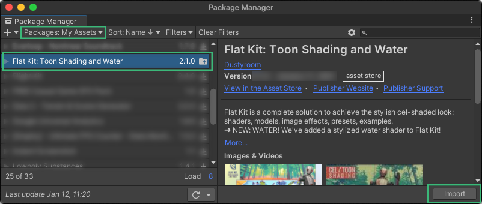

- **Step 2.** Choose which version of Flat Kit to import. If your project is in URP - select [Render Pipeline] Universal (URP).unitypackage. If your project is in Built-In RP, choose [Render Pipeline] Built-In.unitypackage. Click Import. You can re-import any of the versions anytime. The latest imported version overwrites the previously installed one. If you don't see this step, see the note below.  

- **Step 3.** Once imported, go to Project tab ▶︎ Assets ▶︎ Flat Kit. You'll find the Flat Kit unitypackage file of your preferred RP. Double-click it.  

- **Step 4.** Pick what contents of Flat Kit would you like to get unpacked. Click Import. You can import anything at any time while working on your project.  

- **Step 5.** Locate a _[Readme]_ file that comes with Flat Kit and press _Configure for URP_ button on its Inspector panel to finish the installation. The _[Readme]_ file can be found in _Project_ panel ▶︎ _Assets_ folder ▶︎ _Flat Kit_ folder ▶︎ _[Readme]_.  

NOTE. If you don't see _step 2_ while importing, or URP unitypackage is missing, try cleanig the Unity Package Manager cache and import / update Flat Kit after that. The cache files can be found here:  
_Mac OS:_ ~/Library/Unity/Asset Store-5.x (press Shift+Cmd+G in any Finder Window and paste this path)  
_Windows:_ %APPDATA%\Unity\Asset Store-5.x (hidden folder)  
_Linux:_ ~/.local/share/unity3d/Asset Store-5.x  
More info about the Unity cache can be found in the Unity community answers page [here](https://answers.unity.com/questions/45050/where-unity-store-saves-the-packages.html).  

NOTE. The _Step 5_ from the guide above automatically sets **[Flat Kit] Example Settings URP** Universal RP Rendering Asset file that comes with Flat Kit into **Graphics** and **Quality Settings** panels. It's made for convenience, but if you want to modify or change the settings in the Graphics and Quality Panels, you can do so in _Edit_ ▶︎ _Project Settings_ menu. For more information with screenshots please navigate to [this chapter (Flat Kit in URP)](index.md#8-flat-kit-in-urp).  

We included a **Readme** tool, which is a useful debugging helper. It does the following:
  * Shows the stats like Unity, Universal RP and Flat Kit's versions;
  * Detects what RP the project belongs to (Universal RP or Built-In RP);
  * Checks for available updates;
  * Configures Flat Kit for the pipeline of the project;
  * Opens this documentation as well as redirects to Git where you can open a support ticket;
  * Copies debug info which is useful for in-depth troubleshooting.  

The _[Readme]_ file can be found in _Project_ panel ▶︎ _Assets_ folder ▶︎ _Flat Kit_ folder ▶︎ _[Readme]_.  

# 3. Shaders. In-Depth Overview
When you create a material, you’ll choose a shader. By default, Unity has the standard shader picked up. Once installed, all Flat Kit material shaders are located under the Flat Kit sub-menu of the Shader drop-down menu. Please choose the one that would work for your current task. Below is the description of all the shaders.

Our shaders expose shading properties as material features. If a feature toggle is not activated on any materials in the build scenes, the portion of shader code for that feature is not included in the build.
Because of the fact that these shaders are designed for a stylized look as opposed to photorealistic, metallicness and translucency features are not supported. The support for PBR (Physically-Based Rendering) in Flat Kit means that indirect sources of light (e.g. skybox) influence the colors of the material, unless you turn this feature off.
 
At the moment, there are the following shaders included into Flat Kit: _Stylized Surface_, _Stylized Surface Cutout_, _Stylized Surface with Outline_, _Gradient Skybox_, _Water_, _Terrain_, _LightPlane_.

> Collection of shaders in Flat Kit. From a Shader drop-down, hover the FlatKit sub-menu and choose a shader.   

## 3.1. ‘Stylized Surface’ Shader
This is a versatile lit shader to be used on rigid object materials. To use it on a material select the shader “FlatKit/Stylized Surface” or “FlatKit/Stylized Surface Cutout” (Built-In RP only). This is your main go-to shader. It works for the vast majority of cases.  
Stylized Surface shader consists of the following **main** building blocks:

* Color,
* Cel Shading mode (None, Single [Cel], Steps, Gradient),
* Extra Cel layer,
* Specular,
* Rim,
* Height Gradient.

The **additional** parameters are:

* Advanced Lighting,
* Unity Built-in Shadows,
* Texture.

**NOTE:** Each combination of the features above, used in your project results in generating a **shader variant** during the build process. To limit the build time and the resulting binary size be careful not to add un-useful feature combinations. On the other hand, this mechanism makes sure that only the used features are included in the build. More information on shader variants: https://docs.unity3d.com/Manual/SL-MultipleProgramVariants.html

> ‘Stylized Surface’ shader in Single mode. Simple use case.  

> ‘Stylized Surface’ shader in Single mode. More complex use case with more options engaged, but still, uses only Single mode.  

### 3.1.1. The Main Parameters of the Shader

**Color.** This would be the color of your mesh (applicable to most cases, though you can make the shader's other parameters override or mask this main color, if you wish).

**Cel Shading Mode.** This is where you choose the style (mode) of your shading, the color of the shading, and other respective parameters of the modes. Depending on the mode you choose the parameters will look differently. So, let’s talk about modes.

*   **None.** Use this to achieve a simple flat look or to get any other creative picture not involving cel shading, however, the following parameters of Stylized Surface shader will still let you do this, if you choose so.  
Note, the flatness and actual representation of colors on the scene depend on the lighting of the scene. In our demos we use Skybox as the source of lighting. Conveniently, there is a Dependency slider on the Lighting panel of Unity, which tells how much of the influence the Skybox provides. At minimum, there won’t be any shadows, as well as the colors will be identical to those you would choose in the _Color_ block of the shader. At maximum, the Skybox heavily dictates what the colors will look like. For more natural (not necessarily realistic — but natural, organic look of the scene, it’s healthy to let Skybox influence the coloring of the scene).

*   **Single.** This mode provides you with one shadow of chosen _Color_. _Self Shading Size_ is the size of the cel. Larger values mean larger size of the shadow. _Shadow Edge Size_ controls the sharpness of the cel. The lower the value — the sharper the cel. The higher the value — the more blurry is the shadow. _Localized Shading_ is basically how condensed the shadow is. Higher values represent sharper cel. 

*   **Steps.** Basically, you choose the shading color and number of steps to blend from main _Color_ into the color you pick up in _Steps_ mode.

*   **Curve.** The gradient, interpolated transition from one color to another.  
In order to get Steps and Curve modes to work — as soon as you have a number of steps (_Steps_ mode) or curve shape (_Curve_ mode) chosen — the shader will ask you to save its utility ramp texture somewhere on the disk. It will write the transition onto it. The texture will appear red in the editor. This is because internally we use the R8 texture format for efficiency.

> _Steps_ and _Curve_ shading mode of Stylized Surface shader  

**Extra Cel Layer.** This is like another instance of _Single_ mode of _Cel Shading Mode_. Works independently from the _main Cel Shading Mode_. It means, you can make main Cel shading as _None_ (flat), and add an _Extra Cel Layer_. The result will be the same as if you would have used the _Single mode_. Or, make the _main Cel layer_ and _Extra Cel Layer_ almost identical, giving an _Extra Cel Layer_ a darker color, and making it smaller. This would result in stepping, similar to Steps mode with 1 step. Classic toon.

**Specular.** You can make a, well, specular with this parameter. Also it can be used as another layer of shadow.

- _Specular Color_ picks up the color of your glare, the parameter works in HDR.  
- _Specular Size_ determines how big the specular is. Higher values mean bigger specular.  
- _Specular Edge Smoothness_ — moving slider to the left decreases blurriness and makes specular sharper.

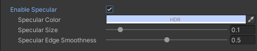
> _Specular_. Inspector interface

**Rim.** Rim was designed as one of the ways to make a specific effect of a color 'wrapping' from behind the object. In some cases it can remind an outline effect.  

- _Rim Color_ selects the color of the parameter. It works in HDR.  
- _Light Align_ parameter rotates the rim.  
- _Rim Size_ controls how big the Rim is. Very high values can serve you as an unlit effect.  
- _Rim Edge Smoothness_ — moving slider to the left sharpens the Rim, to the right — makes Rim blurry. 

> _Rim_. Inspector interface

You can think of Rim as some kind of inner shadow and/or as inner glow, if used on smoothened curvy models. In one of the _Fruit Vase_ demo scenes, there is an example of extensive use of Rim as an outline. On _Blueprint Grid_ demo scene _Rim_ is used as a smooth inner glow. This parameter can be used creatively, for example, to substitute _Curve mode_ or _Extra Cel parameter_. **Just reminding you that the name like 'Rim', 'Specular' etc should not be perceived literally, they can do more than that.** In the screenshot below, with the help of Suzanne the Blender Monkey, we tried to show a few instances of _Stylized Surface_ shader with _None_ mode selected (meaning no straightforward shadows are applied), using orange color, and only _Rim_ parameter enabled. The results are variations of Rim section only. As you see, the _Rim_ alone is quite a creative tool. Imagine adding some creative _Specular_ and _Height Gradient_...

> Variety of uses of _Rim_ parameter alone on Suzanne the Blender Monkey. Interface of _Stylized Surface_ shader with _‘None’_ cel shading mode

Although _Rim_ option is creatively useful and sometimes can remind an outline effect, there are two more obvious ways to add an outline using Flat Kit: to use [Stylized Surface with Outline](index.md#33-stylized-surface-with-outline-shader) shader and/or to use [Outline Image Effect](index.md#42-outline-image-effect) camera component in Built-In RP/Forward Renderer's Renderer Feature in URP. We’ll talk about both of them later in this manual.
 
> **TIP.** Animate Cel layer size, Specular size or Rim size — to get a neat transition effect.

**Height Gradient.** This effect overlays a gradient from opaque selected color to transparent color onto everything you’ve set before. Height Gradient is global (absolute) per material, it doesn't depend on object's boundaries. If you would like to make a relative gradient (for instance, each object holding one material to contain an entire gradient within itself), duplicate the material and adjust the height gradient. Alternatively, you can use a _Curve_ mode of _Stylized Surface_.

> _Height Gradient._ Inspector interface

- _Gradient Color_ picks the parameter’s own color to fade into from transparency.  
- _Center X_ and _Y_ are initial points from where the effect takes effect. Adjust these to move the gradient across the scene. Center X is useful if you engage - _Gradient Angle_, which means the rotation of the Gradient.  
- _Size_ determines how steep the transition of Gradient is. The further the value is from 0 (zero) — the more gradual the effect is. Negative values flip the Gradient.  
- _Gradient Angle_ rotates the gradient.

A bit more about the nature and use of _Height Gradient_ is covered in the [_‘Terrain’ Shader_](index.md#36-terrain-shader) section of this manual.

*_Setting the colors from scripts_*. The following are the color field names for manipulation via the code for tweening, randomization etc:
*   `_Color`: the primary color, “Color” in the inspector,
*   `_ColorDim` (and `_ColorDimSteps`, `_ColorDimCurve` in the corresponding cel shading modes): Color Shaded in the Inspector,
*   `_ColorDimExtra`: the shaded color of the _“Extra Cel Layer”_ feature,
*   `_FlatRimColor`: rim color, requires _“Enable Rim Color”_,
*   `_FlatSpecularColor`: specular color, requires _“Enable Specular Color”_,
*   `_ColorGradient`: the gradient color used along with the `_Color` parameter when _“Enable Height Color”_ feature is active.

### 3.1.2. The Additional Parameters of the Shader

**Advanced Lighting (Light Color Contribution).** Light Color Contribution defines how much the color of the light source of the scene impacts the color of the object. The value of 0.0 results in completely ignoring scene lights, the value of 1.0 results in full multiplication between scene light color and the object color. As an example, imagine the winter morning light. Usually it is blue-tinted, thus all the snow around can’t be white but rather blueish. 

Please note that the effect is visible only if the color of the light is anything but white.

Light Color Contribution works only with directional light. The point and spot lights are contributing to colors and shading of the material regardless of the Light Color Contribution value.

> _Light Color Contribution_ parameter on Flat Kit shaders Inspector panel

Let’s view it in example.  
Three pictures below describe how we change Light Color Contribution values on all (two) used materials: on a sphere and on a plane. Within a picture we change the intensity value of Directional Light as our main source of light.  
Additionally, there is a point light on each picture. This way it’s visible how local lights work together with the main Directional Light.  
Take the first image (below). At first, we turn down the _Intensity_ to the very low value. White sun now has no impact on the scene brightness, resulting in a darker scene.  
Then we change the color of Directional Light from white to red. It has no effect because Directional Light is too “weak” to fill the scene.  
After raising _Intensity_ value back to “1” the scene is now lighter and has a red tint.  

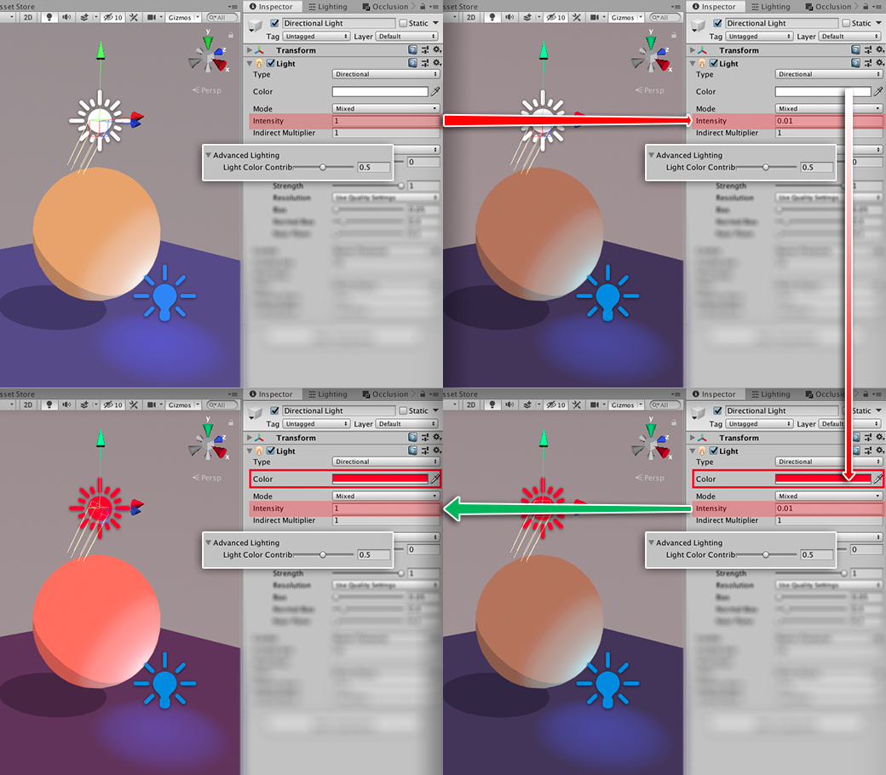
> _Light Color Contribution_ at value 0.5. Changing _Intensity_ value and color of Directional Light

Once we change _Color Light Contribution_ parameter to “0” (pic below), Directional light has no effect light-wise and color-wise. Changing _Intensity_ parameter of Directional Light on the Inspector panel has no effect. Both sides of the picture are identical.  
This way you can achieve a flat look, in other words, the colors on the scene are exactly the same as you choose in the shader parameters.

> _Light Color Contribution_ at value 0. Directional Light _Intensity_ at max and min values

Now, (on the pic below) we raise _Light Color Contribution_ to the max value of “1”. If we set Directional Light _Intensity_ parameter low, the scene theoretically has no source of direct light. Local lights now act as the only light sources. If the _Intensity_ of Directional Light is at its maximum, it’s too hot now.

> _Light Color Contribution_ at value 1. Changing _Intensity_ value of Directional Light

If you use a Particle System and choose your particles to emit light, Flat Kit shaders respect that!

> Particles emitting light on Flat Kit shaders.

**Advanced Lighting (Override light direction).** It is a way to make the material have an independent direction of the light from the Directional Light. This can be useful in cases when you need to align the position of the cels or Rim or Specular. Normally, to adjust these parameters globally, you should rotate the Directional light. Once _Override light direction_ parameter is enabled, the material no longer obeys the Directional Light, it now has independent mapping vectors for the light-dependent parameters (e.g. mentioned earlier cels, Rim, Specular) that you can adjust with _Pitch_ and _Yaw_ parameters. Simply put, you can rotate the the cels, Rim and Specular.  

**Unity Built-in Shadows.** If the object has the ‘Receive Shadows’ option turned on in Mesh Renderer, you have an ability to use Unity-processed shadows on it, as you would do in Unity Standard Material shader, with a few extra-options.

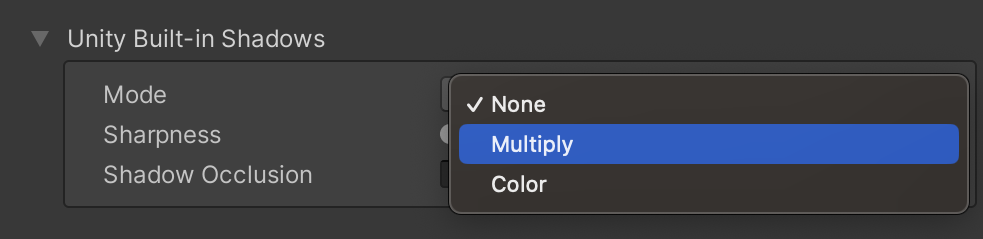
> Unity Built-in Shadows mode menu. Inspector interface

- _Mode_ lets you choose the coloring and blending parameters for the built-in shadows. **None** mode turns the built-in shadow parameter off. **Multiply** mode lets you cast the shadows as in default material. You don’t have direct control over the color. You can change intensity and sharpness. The blending mode is 'Multiply'. **Color** mode lets you choose the color of the cast shadow. The blending mode is 'Normal'.
- _Power_ sets how visible the Unity built-in shadow is.
- _Sharpness_ defines how blurred or crisp the shadow edge is.
- _Shadow Occlusion_ masks received Unity shadows in areas where normals face away from the light. **Useful to remove shadows that 'go through' objects.**

> _Height Gradient_ in _Color_ mode. Inspector interface

**Texture Maps** If you’ve got a UV-unwrapped mesh, you can add a diffuse texture to it. If you work with transparency in textures in Built-In RP, please use _Stylized Shader Cutout_ shader. It can see alpha on the texture as transparency. URP supports alpha by default.

**Albedo** Allows to use the albedo, or diffuse texture. In URP this slot supports transparent textures by default. Can be used together with _Alpha Clipping_ parameter (explained below).

- _Texture selection slot_ lets you pick a texture;  
- _Tiling_ repeats the texture along X and Y axis;  
- _Offset_ shifts the texture along X and Y axis within the UV map of the mesh;  
- _Blending Mode_ lets you choose between 'Multiply' or 'Add' blending modes.  
- _Texture Impact_ parameter controls how visible the texture is. Values to the left decrease visibility of the texture up until it is invisible.  

**Normal Map** To make an impression of a low-poly mesh having many details, you can use normal maps. Add one to _Bump Map_ slot in the Inspector panel.

> ‘Stylized Surface’ shader — normal map applied

- _Texture selection slot_ lets you pick a texture;  
- _Tiling_ repeats the texture along X and Y axis;  
- _Offset_ shifts the texture along X and Y axis within the UV map of the mesh;  

> ‘Normal Map Tree’ demo scene, a tree without and with a normal map

**Emission** Enables Emission map part of the shader.  

**Emission Map** Allows to use custom emission maps to designate the parts of the meshes to have a 'glow' effect.  

- _Texture selection slot_ lets you pick a texture;  
- _Tiling_ repeats the texture along X and Y axis;  
- _Offset_ shifts the texture along X and Y axis within the UV map of the mesh;  
- _Emission Color_ chooses the color of the 'glowing' effect.  

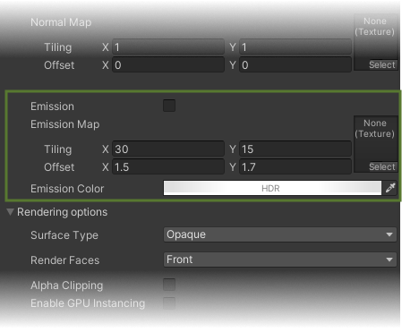
> Emission map part of the Stylized Surface interface  

## 3.2. ‘Stylized Surface Cutout’ Shader

**NOTE:** '_Stylized Surface Cutout_' shader has been deprecated in Flat Kit 2.1.2 for Universal RP version. Because URP supports transparency by default, there's no need for this separate shader in URP. The _Stylized Surface_ and _Stylized Surface with Outline_ shaders can do everything _Stylized Surface Cutout_ could — using _Rendering options_ part of the shaders in the bottom of the interface. There you can find an option to set the shading in transparency mode (_Surface Type_ drop down menu ▶︎ _Transparent_. The default type is _Opaque_) '_Stylized Surface Cutout_' is still available in Built-In RP version.
{: .notice--warning}

Markdown | Less | Pretty
--- | --- | ---
*Still* | `renders` | **nicely**
1 | 2 | 3

This is a version of _Stylized Surface_ shader with an option to treat alpha as transparency on a texture. The rest of the shader is the same.

The _Base Alpha cutout_ parameter determines how much of the alpha portion of the texture is going to be transparent.

> ‘Stylized Surface Cutout’ shader — Valley demo scene, tree branches material. Inspector interface

Use this shader if you work with transparency in Built-In RP. In URP you are good to go with the _Stylized Surface_ shader instead of this one. It will spare a few cycles from your CPU.

## 3.3. ‘Stylized Surface with Outline’ Shader

**NOTE:** _Stylized Surface with Outline_ shader has been deprecated in Universal RP version of Flat Kit: the outline functionality has been moved to the _Stylized Surface_ shader. _Stylized Surface with Outline_ remains available and working for the sake of compatibility with existing projects, but it is advised to use _Stylized Surface_ for the new projects instead. _Stylized Surface with Outline_ has not been deprecated in Built-In LTS version of Flat Kit.
{: .notice--warning}

_Stylized Surface with Outline_ shader, being the same as the regular _Stylized Surface_ shader in a nutshell, has an additional option of... outlines. [_Stylized Surface_ info is here](index.md#31-stylized-surface-shader).

- _Color_ picks up the color of the outline.  
- _Width_ determines how thick the outline is.  
- _Scale_ adjust this parameter when you have gaps on the vertices (please note, this is not an ultimate solution, the gaps need a complex approach — in modeling, adjusting the normals, adjusting camera distance etc).  
- _Depth Offset_ moves the outline inwards or outwards an object.  
- _Camera Distance Impact_ **(this parameter is available in Universal RP only)** makes outlines that are further from camera appear thinner than outlines closer to the camera.  

Remember, in addition to this shader Flat Kit has also a global _Outline Image Effect_ applied per Forward Renderer (in URP) and per camera (in Built-In RP).  
In the [Outline Image Effect](index.md#42-outline-image-effect) chapter in this manual you can find some useful specific and general info.

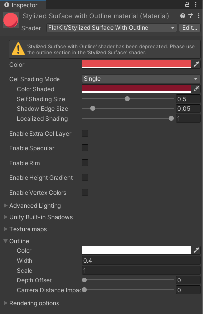
> ‘Stylized Surface with Outline’ shader

Sometimes it is useful to manipulate the normals of your model in order to force the shader to render outlines where it wouldn't do so otherwise.
More on this is covered in [Outline Image Effect](index.md#42-outline-image-effect) chapter. But here's one thing you can try without using 3d editor software. Among the other parameters of the import settings of the model, there is a section where is it possible to change the angle detection threshold for normals. It may come handy in adding or removing some of the outlines where they wouldn't appear normally. Also, slight adjustments to these parameters may resolve some of the visual issues. If you have gaps in the outline, for instance, try tweaking these controls (but remember to backup the project first, it's always a good idea to backup things. In fact, if you are working on something, do it now).

> Import settings of the model has a section for manipulating the normals, which is useful for the _Stylized Surface with Outline_ shader as well as for _Outline_ global effect.

## 3.4. ‘Gradient Skybox’ Shader

This is a simple method to fill the sky of your scene.

- _Top Color_ and _Bottom Color_ define two colors to be blended.  
- _Intensity_ is a darkness/brightness controller of the skybox.  
- _Exponent_ accentuates the effect in favour of either Top Color or Bottom Color.  
- _Direction X angle_ and _Direction Y angle_ rotate the effect along the corresponding axis.  

> **TIP.** Make _Top Color_ and _Bottom Color_ identical colors or move the _Exponent_ parameter to one of the extremes if you want a flat background.

> Gradient Skybox. Inspector panel interface

## 3.5. 'Water' Shader

Water shader works in URP only. There is no Built-In version of a Water shader in Flat Kit.

Water shader lets you create a stylized water surface. That's is primary function. If you feel adventurous, you can make many other wobbling, glittering, weird things with it. It has a lot of parameters to fine-tune the look you want. Although this shader may look a bit complicated at first, it is intuitive and has helping tooltips on the parameters. 

> _Water_ shader interface

First of all, you'll need a surface to place a material with _Water_ shader on. A plane with vertex grid will do fine. The more high resolution the water mesh is the smoother and well-defined the waves will be. For extra interest you can slightly displace the vertices while editing the mesh. With Flat Kit you get a few such models.

The controls are grouped into the logical sections. Let's float through the parameters of the shader.

----------------------------
### Colors

**Source** There are two modes of the color input — _Linear_ and _Gradient Texture_.

> Water color source dropdown

*   **Linear.** This one allows to use just colors for _Shallow_ and _Deep_ parts of water. This effect is simple one — just two colors.

> Water color source - linear

If _Linear_ color source is chosen, two exclusive to this mode parameters appear to select colors:

**Shallow.** Color at the top of the water. 

**Deep.** Color below the surface.  

*   **Gradient Texture.** Use this one if you are looking for something fancy. You can create a depth gradient consisting of several colors. Using a Gradient Editor ramp, you can add up to 8 color stops onto the ramp. Now you have a _Shallow_ color, _Deep_ color and anything you want in between (see _Pool_ demo scene).

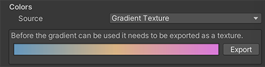
> Water color source - gradient. Clicking on the color window opens the Gradient Editor.

When you click on the white color field, the Gradient Editor will show up.

> Gradient Editor. Edit the gradient and close the window, then save the texture.

After you finished editing the color gradient, click the 'Export' button to save the texture somewhere on the disk. We recommend to name the textures with the names beginning on something like 'water...' or 'awesome_gradient...' because later you'll have these textures stacked up one below another in the texture selection window, and it will be much quicker to scroll through them.  
When you have your texture saved, the material will be instantly filled with this gradient.

> Export Button. Click it and save the texture to the disk.

**Shallow Depth.** This is a lowest point of _Shallow_ part. It is a point where _Shallow_ part merges with the top of the gradient.

**Gradient Size.** This is the lowest (deepest) point of the gradient. It is a point where it merges with the _Deep_ part.

Below is a little chart, which may came handy for understanding the parameters for the coloring part of the _Water_ shader.

> Water Gradient chart

**Transparency.** How clear (transparent) the color of the water is. The transparency doesn't affect other parameters like foam or refractions. This allows you to achieve awesome weird optical effects.

**Shadow Strength.** How visible the shadow is.

----------------------
### Crest

Crest parameter colors the tips of the waves.

**Color.** The color of the wave. It helps accentuate individual waves.

**Size.** How big of a part of a wave is colored (accentuated).

**Sharp transition.** How smoothly the accentuated wave blends into overall color of the water.

----------------------
### Wave geometry

This section determines the overall shape of the waves. All the controls for the mesh displacement can be found here.

**Shape.** The formula that determine how the displacement of the waves is shaped and distributed across the mesh.
*   **None** turns displacement waves off. As no waves are visible, the surface becomes flat.
*   **Round** is linear (comb-looking) shape with rounded tips;

> Shape parameter — 'Round'
*   **Grid** is grid-like (checkerboard-looking) shape;

> Shape parameter — 'Grid'
*   **Pointy** is more linear (comb-looking) movement with sharp tips.
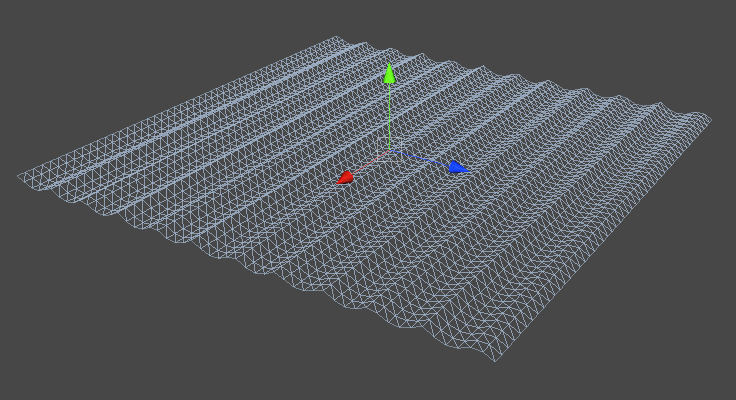
> Shape parameter — 'Pointy'

**Speed.** How fast it moves along the Direction parameter.  

**Amplitude.** Sets deviation amount, or, how high it is. Use this parameter to set the height of the waves. Positive values 'raise' the waves effect above the base point, negative values make the waves lower than the initial base point.

**Frequency.** Density of the effect.  

**Direction.** Direction of the motion. This parameter works tightly with _Speed_. Using these two you can make ponds, pools, seas etc (static water) and rivers, waterfalls etc (streaming water). Please, note, there's an independent set of parameters _Speed_ and _Direction_ for foam as well, described a bit further.

**Noise.** Adds nonlinearity to the _Shape_. Use it to make _Grid_, for example, more chaotic.  

----------------------
### Foam

**NOTE:** In order to see the foam, the model must be UV-unwrapped.

**Source.** How the foam is being made — from texture or generated from noise. Please, select one of the following parameters.
*   **None.** Turns off the foam.
*   **GradientNoise.** The foam shape comes from generative noise.
*   **Texture.** If you choose _Texture_ source, you'll have an option to import your own, preferably seamlessly tiling, texture, or use one of the included ones — we shortlisted the best from dozens of originally pre-generated .png textures to come with Flat Kit. If you are planning to use your own textures, we suggest you to put them into a single (red) color in the import settings to save memory.

**Color.** Color value of the foam. Can be opaque or transparent.  

**Shore Depth.** The maximum point where the water is detecting the edges to create a foam 'outline'.  

**Amount.** How often 'grains' occur.  

**Scale.** How big the foam 'chunks' are.  

**Sharpness.** How smooth or sharp the foam is.  

**Stretch X.** How stretched the foam is along X axis.

**Stretch Y.** How stretched the foam is along Y axis.

> **TIP.** Sometimes we find it useful to generously stretch the foam along one of the axis, so that the foam becomes a set of straight lines. This effect definitely can have its use.

**Speed.** How fast it moves along the Direction parameter.  

**Direction.** Direction of the motion. This parameter works tightly with _Speed_. Using these two you can make ponds, pools, seas etc (static water) and rivers, waterfalls etc (streaming water)

----------------------
### Refraction

Use these parameters to control the optical distortion of the water.

**Frequency.** The frequency of noise that creates the refraction.

**Amplitude.** The deviation from the initial point.

**Speed.** How fast the refraction moves on the water.

**Scale.** How big is the noise that creates the refraction.

----------------------
We included a component called _Buoyancy_. The _Water_ shader deforms the water mesh, which in its turn moves the objects that have _Buoyancy_ component on them. More info can be found in the [Buoyancy](index.md#53-buoyancy) part of Additional Scripts section of this manual.

> **TIP.** Place the plane somewhere behind or in front of your scene objects. Place the _Water_ shader on it. Set _Clearness_ to max, set foam _scale_ to very high, lower the _frequency_, as well as opacity. With fine-tuning, it is possible to achieve something like a film grain effect.

## 3.6. ‘Terrain’ Shader

Terrains are great in Unity. But it’s not so trivial to work with terrain materials, that is why we added a separate shader that deals with the Unity Terrain system.

If you are not familiar with Unity Terrains, please refer to their documentation. In two words, terrain uses Terrain Layers, something like containers of all textures — diffuse, normal, bump etc. FlatKit _Terrain_ shader sees those textures and applies its own colors onto the layers. Since we are talking about the flat look, no normal or bump maps are required. In order to have full control over colors of the terrain, you can load a plain white texture as your terrain layer (on _Valley demo_ scene we did so). All the colors will be available from the shader interface, they will be multiplied with your white texture, resulting in the pure color you choose. If you are already familiar with _Stylized Surface_ shader, _Terrain_ shader interface won’t be news to you. [_Stylized Surface_ info is here](index.md#31-stylized-surface-shader).

This is an appropriate time to talk about Height Gradient parameter Flat Kit offers. You can use it as a part of Stylized Surface, Stylized Surface Cutout and Terrain shaders. Height Gradient works wonders on terrain in context of flat shading.

Usually flat shaded landscape objects lack organic embellishment the real world has. All extra-shadows, small scale details, big and tiny grunge spots etc make the picture nonlinear to our eyes, thus, interesting, engaging. With flat aesthetics — there is a color, there may be a shadow or shadows, maybe a few models for the more natural look. The result — quite a boring scene. If you want a more polished look, you’ll want to fight linearity, with _Height Gradient_ coming handy. It stretches the interpolation between transparency and its own color along the vertical axis (by default) and multiplies the gradient over the colors you already have. You can rotate the direction, so that it is no longer vertical but diagonal, horizontal and all in-between.
This effect changes the scene dramatically. Now, the terrain has its shadow work that you set on the interface, and on top of that there is a gradient, subtle or obvious. Immediately, it adds depth and a more professional look to the scene.
If you work on some kind of an environmental landscape object but do not use Unity Terrain, please use the _Stylized Surface_ shader instead of _Terrain_. _Height Gradient_ is available there, too.

> Height Gradient on Unity Terrain (without on upper image, with — on lower one). Valley Demo Scene

## 3.7. ‘LightPlane’ Shader

This shader is what we are particularly proud of. It looks like a small tool. But it has immeasurable possibilities. Fog, mist, delicate scene boundaries, light beams, glow of magic swords, laser beams. These things are what _LightPlane_ is for.

The _Wanderer_ demo scene includes _LightPlane_ shader implemented not only as fog areas, but also as light beams of so-called pick-up objects and even as planets. The _Valley_ demo scene has got the _LightPlane_ shader used as floating air particles thanks to the Unity particle system.

> LightPlane Shader. Inspector panel interface

The parameters of the _LightPlane_ shader are:

- _Depth Fade Distance_ determines how the shader's transparency behaves depending on camera's distance; 

- _Camera Distance Fade Far_ controls the farther edge of the gradient from opaque to transparent (see pic below).

- _Camera Distance Fade Close_ controls the closer edge of the gradient from opaque to transparent (see pic below).

> _LightPlane_ — _Camera Distance X and Y_ parameters

- _UV Fade X_ controls transparency on the sides along X axis of the plane/mesh (see pic below);  

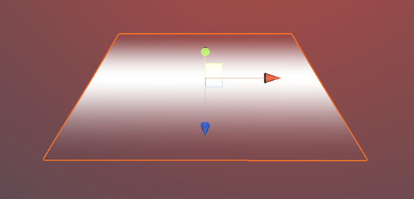
> _LightPlane_ — _UV Fade X_ parameter

- _UV Fade Y_ controls transparency on the sides along Y axis of the plane/mesh (see pic below); 

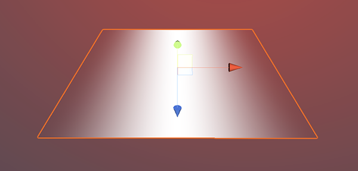
> _LightPlane_ — _UV Fade Y_ parameter

When combined, _UV Fade X_ and _UV Fade Y_ can make a fluffy blob.

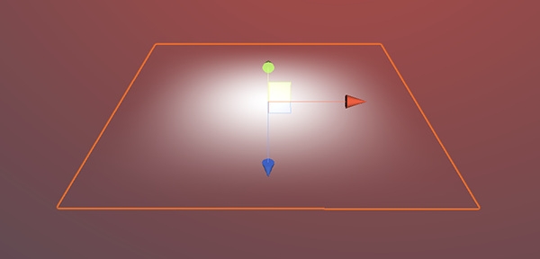
> _LightPlane_ — _UV Fade X_ and _UV Fade Y_ parameters combined

- _Allow Alpha Overflow_ makes alpha more than '1', used for HDR, looks nice with some bloom.

## 3.8. GPU Instancing

When the `Enable Instancing` option is enabled on a material, the shaders can perform [GPU Instancing](https://docs.unity3d.com/Manual/GPUInstancing.html) of the following fields that are common across all Flat Kit shaders:

1. _Color_ value (property name `_Color`),  
1. Parameters of the cel shading mode _“Single”_  
    - _Shaded Color_ value (property name `_ColorDim`),  
1. Specular parameters, active when _“Enable Specular”_ is checked  
    - _Specular Color_ value (property name `_FlatSpecularColor`),  
    - _Specular Size_ value (property name `_FlatSpecularSize`),  
    - _Edge Smoothness_ value (property name `_FlatSpecularEdgeSmoothness`),  
1. Rim light parameters, active when _“Enable Rim”_ is checked  
    - _Rim color_ value (property name `_FlatRimColor`),  
    - _Rim size_ value (property name `_FlatRimSize`),  
    - _Edge Smoothness_ value (property name `_FlatRimEdgeSmoothness`),  
    - _Light Align_ value (property name `_FlatRimLightAlign`),
1. Unity shadow parameters, located in the _“Unity Built-in Shadows”_ section  
    - _Color_ value (property name `_UnityShadowColor`).

# 4. Image Effects

Both _Fog_ and _Outline_ image effects rely on image-based anti-aliasing, like the one in Unity's Post-processing stack. 

  * In Universal RP (URP) — post-processing effects are called ‘Renderer Features’ of the Forward Renderer.
  * In Built-In RP: Post-processing is made of Camera effects placed onto the camera in the scene as Components.
  
## 4.1. Fog Image Effect

Fog Image Effect camera component can be reviewed as a post-processing effect. It can be subtle, like a mist in the lower part of the valley, or a dominant effect, as in a completely hazed environment. Simply put, it works in the following way. You decide whether you need only length fog or height fog or both. Then you determine the bounds where it would take effect. Then you choose colors along each dimension. And after that, blend between distance and height. This effect starts from camera position up to the Near/Far, Low/High bounds, meaning, your camera is the zero coordinate from where the fog spreads. Each camera on the scene can have a separate independent instance of an effect.

Because Unity’s MSAA (multi-sample anti-aliasing, which is an option in the Quality Settings of your project) does not apply to depth texture, there may be inconsistencies between the anti-aliased color image and the unprocessed depth image. This may look as aliasing if fog intensity is set to a high value. *Such artifacts may only occur if using MSAA*, so we recommend using screen-space anti-aliasing, such as in Unity’s post-processing stack that you can import by going to Window ▶︎ Package Manager in Unity 2018+.

When you click on any of the color ramps (Distance or Height Gradient), the Gradient Editor pops up.

Fog Image Effect is being used in the _Wanderer_ demo scene (more subtly) and _Valley_ Demo scene (more accentuated).

> Fog Image Effect. Inspector panel interface

Gradient editor controls the colors of the gradient. To open it, click on Distance Gradient or Height Gradient. The bottom row of breakpoints (pointing up) is the selection of the colors. The above row (pointing down) controls the opacity of the area it points at; the opacity value of one breakpoint fades into the opacity value of the adjacent one. Same for colors.

> **TIP.** If you want the area close to you to be without fog, apart from increasing Near parameter, you can open up the color ramp(s), add a breakpoint next to the leftmost one on the ramp, select leftmost one, make it transparent (see screenshot of Gradient Editor below). The breakpoint you created (opaque, next to the transparent one) becomes your distance or height control.

> Fog Image Effect. Gradient Editor interface.

## 4.2. Outline Image Effect
Outline Image effect is, essentially, a contour on the objects on the scene. It can draw outer outlines, inner ones or both outer and inner outlines of the objects.

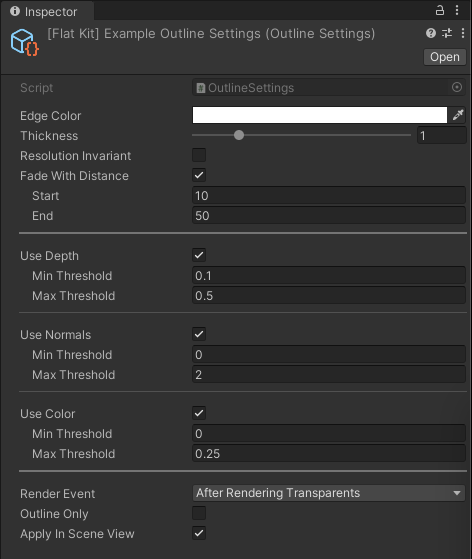
> Outline Forward Renderer in URP. Inspector interface.

### Setting up Flat Kit Outline (URP)

If you are working in a Universal Rendering Pipeline (URP) project, the post processing components you used to put on the camera in the old Built-In RP ('Standard', '3D' project) — they are called 'Renderer Features' in URP and can be found in the settings of the Forward Renderer.  

Please, make sure that you installed Flat Kit properly as described [in this manual above](https://flatkit.dustyroom.com/#2-quick-start-beginning-to-work-with-flat-kit).  

Particularly, to make Universal RP generate post-effects (aka Renderer Features), please pay attention to the steps 5 and 6 in [the guide in the manual](https://flatkit.dustyroom.com/#2-quick-start-beginning-to-work-with-flat-kit). 
In short, you'll need to set **[Flat Kit] Example Settings URP file** in **Graphics panel** (Edit ▶︎ Project Settings ▶︎ Graphics panel) and in **Quality panel** (Edit ▶︎ Project Settings ▶︎ Quality panel).  

After that you'll be able to load, for example, _Wanderer_ demo scene that comes with Flat Kit, launch the scene (press Play) and see the outlines displayed.  

To be able to use Flat Kit's Outline in your own scene, you can either go from scratch:  

1. Create a new **Forward Renderer**. To avoid further confusion, name it, for example, _MyNewAwesomeForwardRenderer_. (Go to Assets menu on top ▶︎ Create ▶︎ Rendering Universal Rendering Pipeline ▶︎ Forward Renderer).   
2. Add it to the **Renderer List** of the **[Flat Kit] Example Settings URP** file in the Inspector panel. To do this, go to **Project panel ▶︎ Flat Kit ▶︎ ExampleSettings ▶︎ [FlatKit] Example Settings URP**. Select it, look at the Inspector panel, see the **Renderer List** section, press **'+'** button and drag _MyNewAwesomeForwardRenderer_ Forward Renderer you created in step 1 — into the created line of the **Renderer List**.  
3. Select that newly created _MyNewAwesomeForwardRenderer_ Forward Renderer, press **'Add Renderer Feature'** and Select **Flat Kit Outline**. This will add the Outline Renderer feature. But to be able to adjust parameters, like width, color of the outlines, you'll need to create the Outline Settings file.  
4. Go **Assets menu on top ▶︎ Create ▶︎ FlatKit ▶︎ Outline Settings**. This creates an Outline settings file. Name it _MyNewOutlinesSettings_.  
5. Add this _'MyNewOutlinesSettings'_ settings file to **Flat Kit Outline** Renderer Feature you created in step 3 — into the **Settings** field.  
6. In your scene select the camera (Main Camera) in Hierarchy panel, look at Inspector panel, find **Rendering** section and in the **Renderer** drop down menu select _MyNewAwesomeForwardRenderer_ Forward Renderer you created in step 1.  
7. You may need to launch the scene by pressing Play.  

Or, you can do it the easy way.  

1. In your scene select the camera (Main Camera) in Hierarchy panel, look at Inspector panel, find **Rendering** section and in the **Renderer** drop down menu select _[FlatKit] Wanderer-ForwardRenderer_ or _[FlatKit] FruitVaseScene-Var-ForwardRenderer_. They both have outlines already engaged.  
2. You may need to press Play.  

To change the parameters of the outlines then, please: 
  * Press _Ctrl + F (Windows)_ or _Cmd + F (macOS)_ and type _[FlatKit] Wanderer-Var-OutlineSettings_ in the search field that becomes active in Project Panel. Select the found file and change the parameters in the Inspector panel.

### Parameters of Flat Kit Outline

**Main settings** are the following.

- _Edge Color_ lets you choose the color of the outline.  
- _Thickness_ makes the outline thicker or thinner. It controls how wide or narrow the line of the outline is.  
- _Use Depth_ enables or disables taking the scene's depth data into calculating the outlines. This parameter outlines the outer contour of the objects with depth threshold control.  
- _Use Normals_ creates outlines for “inner” parts of the objects, meaning, for those that are inside the boundaries of the object, for every given camera perspective. The effect depends on the geometry of an object. So, having proper normals here is important. There is a Normals Threshold control. It's discussed a bit more a little further down.  
- _Use Color_ enables or disables taking all color difference data on the scene when calculating the outlines. This feature is URP only.

**NOTE:** If you see that _Use Depth_ and _Use Normals_ have no effect in your project, please navigate to Project Settings -> Graphics and insert **[FlatKit] Example Settings URP** file into _Scriptable Rendering Pipeline Setting_ field. If you are using your own settings file instead, please make sure to have _Opaque texture_ and _Depth texture_ checkboxes on, which can be found on Inspector tab when you select that URP settings file.

**Advanced settings** section hosts the parameters to adjust the tools above as well as a few more controls. The thresholds parameters are basically the limits that determine the ranges in which the effects take places. For example, the higher Min Depth value is, the further away from camera the outline will be generated. The lower Max Depth value is, the sooner outlines stop occurring.  

- _Min Depth Threshold_ and _Max Depth Threshold_ determine the range of depth differences where outline should be applied. Lower values draw lines “inside” the scene resulting in a more beveled image. Higher values have more flat effect.  
- _Min Normals Threshold_ and _Max Normals Threshold_ determine the range of normals edges to be outlined. Lower values increase the amount of affected normals, leading to more stroked effect. Higher values decrease the amount of affected normals, leading to flatter look. Basically, it determines min and max angles of the normals for the outlines to occur.  
- _Min_ and _Max Color Thresholds_ let you set the least and the strongest differences in color of the mesh to make the outline appear. This feature is URP only.  
- _Outline Only_ renders the outlines without meshes themselves, making it a kind of wireframe renderer. This feature is URP only.
- _Render Event_ This is one quite powerful feature available on the interface. It lets you choose an event after which the outlines are applied. It allows to apply outlines over the transparent objects. Also, it allows you to stack the _Outline Image Effect_ with other post effects. This feature is URP only.

You'll need to *press 'Play'* to see the effect of _Render Event_.

> Outline Image Effect Render Event list

Here is an example of choosing when to render the outlines. We took _Wanderer_ demo scene and applied an example _Outline_ Image Effect. After that we tried a few different items from the _Render Event_ list.

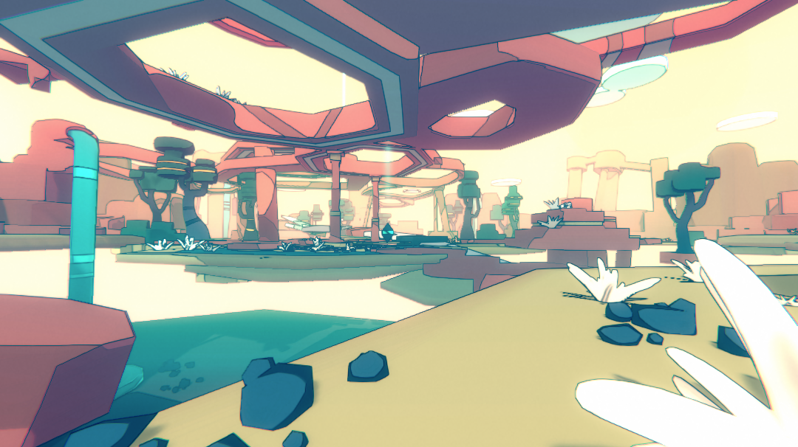
> _'After Rendering Skybox'_ chosen in Render Event list. _Wanderer_ demo scene

> _'Before Rendering Post Processing'_ chosen in _Render Event_ list, _'Outlines Only'_ parameter ticked

Also, in URP you have an ability to chain and change the orders of Image effects, but it's a general Unity information. More info in the chapter [Flat Kit Image Effects in URP](index.md#83-flat-kit-image-effects-in-urp)

Please, note that _Outline Image Effect_ is a global effect, as it is used as the camera component in Built-In RP and as a scene's Renderer Feature in URP, which is suitable for a consistent look of your project. If you would like to outline a particular object on your scene, you can engage the shader instead — [Stylized Surface with Outline](index.md#33-stylized-surface-with-outline-shader) shader.

If you would like to exclude an object from an outline pass, considering that you are using one of the Stylized Surface shaders, and you are in a URP project, please go to the interface of the shader and switch rendering to 'Transparent'. It won't change the look of the shader but will exclude it from the outline pass. You can control this too as described a few paragraphs above in Render Event list part.

If you would like to use depth and normals data as sources for outlines, please enable the _Flat Kit Depth Normals_ renderer feature on the forward renderer interface.

> Flat Kit Depth Normals Renderer Feature

Some general info. Manipulating the normals of the mesh can be a very efficient way to control the behavior of the outlines. It can be done in a 3d editor. For example, here's how to do it in Blender.

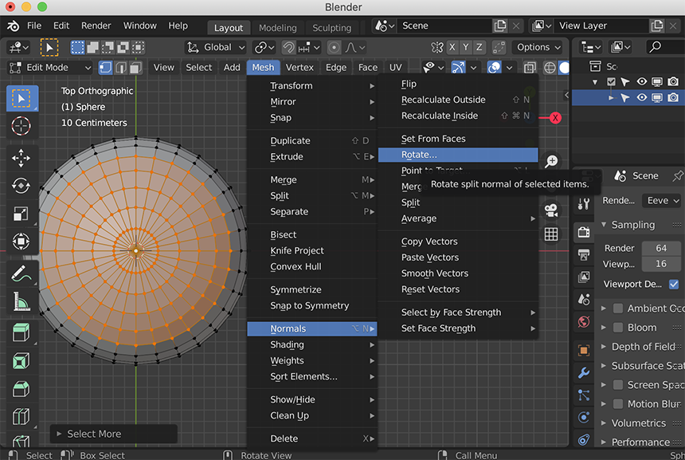
> Rotating normals in Blender. Manipulating the normals angle is one of the ways to make Flat Kit generate outlines where you want them

> **TIP:** Combinations of the settings in Outline Image Effect let you control the behavior of the outlines quite widely already. You can get even more control on the outlines using _‘Stylized Surface with Outline’_ shader in addition to the global Outline effect. Also, _Rim_ parameter of _Stylized Surface_ and _Stylized Surface with Outline_ shaders can accentuate object's edges, often it looks like a partial outline, which can be helpful.

# 5. Additional scripts

## 5.1. UV Scroller

Used in the _Wanderer_ demo scene. It scrolls waterfall texture along the Y axis. Also used in _Ocean Water_ scene under the waterfall.

## 5.2. Linear Motion

Linear Motion is a simple script that translates (moves) and rotates any object. We used it heavily on cameras to prepare promo video footage. There is an option to translate or rotate along the X, Y, Z axis.

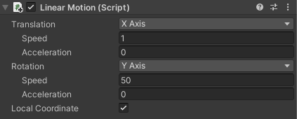
> _Linear motion_ script. Inspector interface

> **TIP.** Use a couple of instances of this component if you want to translate and rotate along more than one axis and make more complex automations.

## 5.3. Buoyancy

This script is used with _Water_ shader specifically when there is an object on the water surface, and you want it to physically flow on this surface. The object will replicate the water's shape, while water is being deformed. This scripts is added on the object as a component. You'll need to point to the water object mesh this object is interacting with (in _Water_ field of the script interface).

> _Buoyancy_ script interface

- _Water_ field is where you choose the mesh of the water surface. The object holding this script will be afloat on this mesh.
- _Size_ parameter sets the definition of the movement, meaning, how many of the _Water_ object's vertices it takes into account.
- _Amplitude_ is how far the object travels from its initial point on the water while floating.

# 6. Demo Scenes

We tried to depict the big spectrum of possibilities using various scenes. They are one of ten million examples of possible Flat Kit use cases. Consider viewing them as starting points or macro-preset objects for your own project.

* _Valley_, _Wanderer_ scenes are environmental. There we tried to show the work of both fog systems of Flat Kit. Also it is one of the perspectives of displaying the shaders — how these would look in a large scene.

Valley uses Terrain shader and transparent textures inside a Stylized Surface Cutout shader. Valley demo scene is also an example of obvious, rather than subtle, use of _Fog_ Image Effect. Once the scene is loaded, you can scan through the _Fog_ Image Effect presets to find which one you like more. There is a Presets chapter later in this manual with explanation of how to use them.
In a _Valley_ scene, please, note that although the ground is made with Unity native terrain, the trees on it are populated manually, not using the terrain system.

* _Blueprint Grid (Mugs)_ and _Fruit Vase_ scenes are an exhibition of most sought use cases of cel / toon shading.

However, you can find more experimental stuff there, too. It has been a temptation to overpopulate the scenes with content, because while making these included materials — literally dozens of interesting by-product or work-in-progress materials showed up, but we had to discard them to keep the scenes clean.
Blueprint Grid is a descriptive one, there is a text telling what we used to get the displayed materials.
Fruit Vase is actually a collection of 7 scenes. There is one vase with fruits across all scenes and each scene is dedicated to some specific look, thus uses a different set of materials.

* _Tree Island_ scene is a showcase of a more cartoony use case. Imagine a 3d-platform game with such a look. Or Any other arcade game.

* _Room_. We just had to include a room.

* _Retro Cars_. Retro cars are curvy. A great opportunity to show how shiny (or rough) shaders can be.

* _Normal Map Tree_. An example of normal maps application.

* _Ocean Water_. This is a demo scene showcasing the _Water_ shader in a way the game would look like. A non-toon-shading application for _Stylized Surface_ is showed in this scene, too. You can choose various water looks in the Hierarchy tab by switching different Water objects on.  
**NOTE:** This scene will work in Universal RP only.

* _Pool_ scene shows more various versions of the _Water_ shader. In the Hierarchy tab you can choose between different water objects. Each of these objects has its own _Water_ material.  
**NOTE:** This scene will work in Universal RP only.

* _Water Vessels_ is an attempt to show a few basic and more non-obvious _Water_ shader parameters, all at once. Having these materials, you can use them as starting points in you own projects.  
**NOTE:** This scene will work in Universal RP only.

# 7. Presets

Unity has its own Preset management system. The preset is the saved current state of the shader, in our case, the Flat Kit material. The presets are available across scenes and can be saved whenever you want inside the current project. For convenience, we saved the most useful presets inside a shared presets folder (Assets/FlatKit/PresetsShared).

In Flat Kit you can find presets as .mat Material instances (that you can drag and drop on the objects) and .preset Unity Presets (saved states of shaders that you can recall from interface of already applied materials). The sets are identical. Unity presets (.preset) are great when you have a material (.mat) applied to lots of objects and you want to swap it with a preset you already have.

To save the preset, select the material or an object with this material you want to save, click on the ‘mixer’ icon on the top right of the shader interface on the Inspector panel. Then, the menu will pop up. Click ‘Save Current to…’. Then you choose the destination. Once created, you can move the actual file wherever you would like. All presets within a project will show up in the ‘Select Preset’ menu.

> Preset menu. How to load.

Save, recall, experiment, discard bad results, save great results, all by using Unity’s preset system. You cat A/B this way and share the shader’s parameters across multiple separate materials. Scan through them and once you stumble upon something close to what you are looking for, adjust the one.

> **TIP.** Naming the preset files as descriptive as possible is a gratifying practice. It would save your time later when you gather lots of them. It would be easier to navigate through them and distinguish between them, and also the proper names would remind you what you had in mind at the moment of saving the preset. Just look at the screenshot below.

# 8. Flat Kit in URP

Although many of the features in Flat Kit look identically in URP and in Built-In RP versions, the differences are becoming inevitable for a couple of reasons. Built-in RP is being deprecated by Unity, URP is faster and it is a way to go, URP offers the tools Built-In RP is lacking. One of the differences is in post-processing. Flat Kit Built-In RP uses Post-Processing Stack v.2. Flat Kit URP uses URP's native Volume toolkit. Both of these offer similar post-processing tools but they behave differently. Even when using the same values for Color grading section in Built-In RP and URP, the outcome is slightly different.

Please note, Flat Kit had been initially created for the Built-in Rendering Pipeline. To keep the visual results as close to the original as possible, the URP version of Flat Kit is using HLSL code rather than shader graph. It means you can switch a Flat Kit project between URP and Built-in RP at any point without extra work. However if you’d like to edit the shaders, you'll need some programming skills.

## 8.1. Known Limitations

Although we did our best to make Flat Kit support URP, the pipeline itself is not yet fully mature and brings some limitations. Until Unity has updated the URP, we are working on building our own workarounds in order to make things work.

The current limitations are:

* SRP Batcher is not yet supported by the Stylized Surface shaders.

## 8.2. URP Installation

In order to have a working Flat Kit in Universal RP (we've included the URP version alongside the Built-in pipeline version, in a single package), you'll need to have Unity's Universal RP package installed in your project.

After that, you will need to use a Universal RP Asset file. You can either use the one that comes with Flat Kit, called **_[Flat Kit] Example Settings URP_**, or you can create your own URP asset file to work with.
  * Right click on Assets (in Project tab) ▶︎ Create ▶︎ Rendering ▶︎ URP ▶︎ Pipeline Asset.

Once you do it, the Asset and Forward Renderer are created.

Please, refer to the chapter ['Quick start. Beginning to work with Flat Kit'](index.md#2-quick-start-beginning-to-work-with-flat-kit) in the beginning of this manual for more important information about setting up Flat Kit and using URP Pipeline Asset files.  

The last step of the installation shown in the video in a chapter ['Quick start. Beginning to work with Flat Kit'](index.md#2-quick-start-beginning-to-work-with-flat-kit) was pressing _Configure for URP_ button in a _[Readme]_ file that came with Flat Kit. This automatic step replaces two manual steps of setting up Flat Kit in Universal RP:
- **Manual Step 1.** Navigate to _Project Settings_ -> _Graphics_ and insert **[FlatKit] Example Settings URP** file into _Scriptable Rendering Pipeline Setting_ field.
If you are using your settings file instead, please make sure to have _Opaque texture_ and _Depth texture_ checkboxes on, which can be found on Inspector tab when you select that URP settings file.  

- **Manual Step 2.** Please, do this in _Quality_ tab's _Rendering_ field as well. This Example Settings file comes with Flat Kit — select **[FlatKit] Example Settings URP** file. Do it for all Quality levels.  
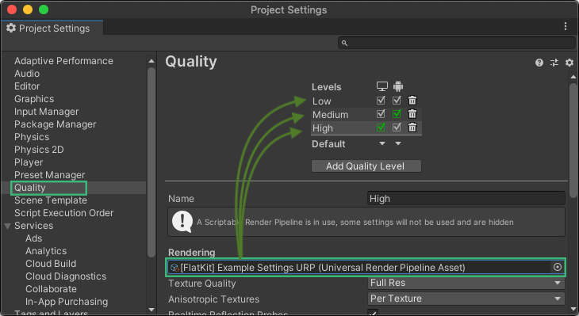

Here's a video showing setting it up.  

<iframe width="560" height="315" src="https://www.youtube.com/embed/8yiihlFPmGg?start=108" title="YouTube video player" frameborder="0" allow="accelerometer; autoplay; clipboard-write; encrypted-media; gyroscope; picture-in-picture" allowfullscreen></iframe>  

## 8.3. Flat Kit Image Effects in URP

In URP, 'Fog' and 'Outline' image effects, included in Flat Kit, are no longer image effects, they have been adapted to become Render Features. Unlike the conventional image effects that are added to the camera game object, Render Features are added as stages to the Forward Renderer.

To use Flat Kit effects, please first update the Universal RP to the version higher than 8.2.0.

Go to Window ▶︎ Package Manager ▶︎ Universal RP ▶︎ Select the version to upgrade to ▶︎ click Upgrade

Our example scenes already include configurations of the Forward Renderer with outline and fog image effects (look for the URP Config folders in the demo directory).

To enable outline and fog, select the ForwardRendererConfig and add the 'outline' or 'fog' stage. In the case of 'outline' effect, you also need to add the DepthNormalsPass stage.

The order of the effects can be managed like this.

> Managing the order of renderer layers in URP

It's a default URP thing. What is worth noting is that for Outlines we made an option to choose the order of Renderer Events within Outline Image Effect interface. Please, refer to the corresponding chapter of this manual, [Outline Image Effect](index.md#42-outline-image-effect).

## 8.4. Post-processing V2 in URP (General Info)

We use PPv2 in our demo scenes for additional image effects. To enable these additional effects you need to:

Go to Assets (in Project tab) ▶︎ Universal Rendering Pipeline asset ▶︎ go to Inspector tab ▶︎ Post-processing Feature Set ▶︎ select Post Processing V2 from the drop-down.

Enable the Post Processing flat on the camera inspector:

> Camera properties. How to enable Post-processing v.2

# 9. Contact information and links

[Flat Kit at the Asset Store](https://assetstore.unity.com/packages/vfx/shaders/flat-kit-cel-toon-shading-143368)

Email  
info@dustyroom.com

[Dustyroom website](http://dustyroom.com)

[Twitter](https://twitter.com/_dstrm)

> 
