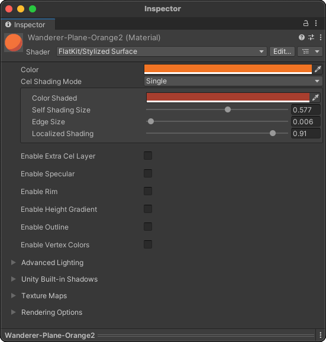
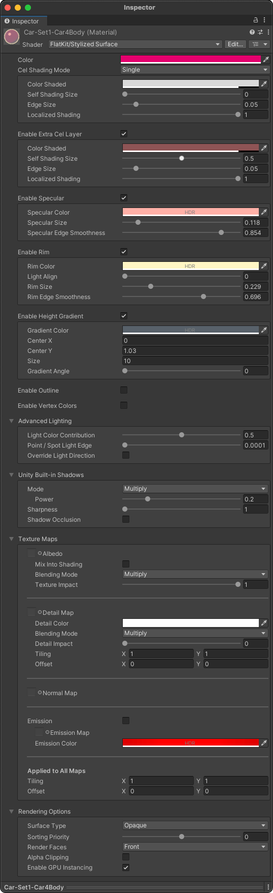
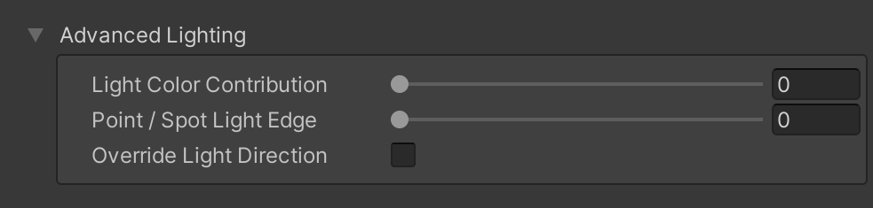
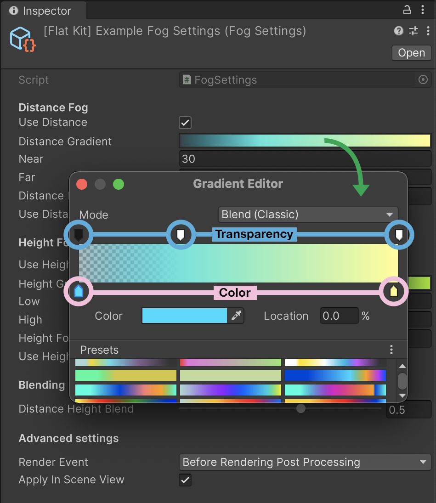

If you’ve got a question regarding Flat Kit, please read through the Frequently Asked Questions, and try searching for the answers here. If the question is not covered, please shoot an email to info@dustyroom.com. If you find a bug, it really helps us if you include steps to reproduce it. Please mind that we get lots of messages daily, be patient - we’re getting to it. Also, if you've got a feature you’d like to see implemented, let us know — some of the great ones came from the suggestions. Flat Kit is a vast field of stylistic possibilities, so please make sure you skim trough this manual, it may help you understand all the features better and give you a few ideas.

# Frequently Asked Questions (FAQs)

Q. Does Flat Kit support URP?  
A. Flat Kit supports URP as well as Built-In RP. There are a few known limitations, please see FlatKit in URP. As Built-In RP is being deprecated by Unity an it has its drawbacks, we continue to support it but we develop new great features mostly for URP. Please note, there is no HDRP version of Flat Kit.

Q. There are missing scripts in some demo scenes on the main camera in URP.  
A. This is an old one, so if you see the missing scripts, please update to the newer version of Flat Kit. In Built-In RP our demo scenes use Unity’s PostProcessing Stack V2. It is not required if you are not using the demo scenes.

Q. Is it easy to use Flat Kit for a beginner?  
A. Yes, there's nothing complicated about it on the front-end. Yes, there are lots of parameters but they are well-structured and laid-out in an intuitive way. Moreover, there are mouse-over tooltips with little hints on all parameters.

Q. Does Flat Kit support PBR (Physically-Based Rendering)?  
A. In Flat Kit indirect sources of light influence the colors of the scene by default, which can be turned off. The shaders do not support parameters required for the photorealistic look such as metallicness and translucency and subsurface scattering.

Q. Does Flat Kit support normal maps?  
A. Yes, it does. It is in Bump map section of the interface.

Q. Does Flat Kit work with Post-processing stack v.2?  
A. Yes, it does. The fog and outline image effects can be added on the same camera as the Post-processing component (Built-in Rendering Pipeline). Post-processing in URP is known as ‘Renderer Features’, so you don't have to install Post-Processing v.2. See FlatKit in URP if you are willing to know more.

Q. Does it work with Unity version 20XX.x?  
A. As soon as you’ve got a stable Unity version, it does.

Q. What platforms can I build for? What about VR?  
A. Flat Kit shaders work in builds for all platforms listed in Unity Build settings, including VR, WebGL and mobile. Please, note, the Outline image effect currently is not optimized for VR.

Q. Can I use the scenes from Flat Kit in a commercial project?  
A. Yes, you can. As soon as you purchase it, you can use anything from Flat Kit in the private and commercial projects without a need to credit authors of the asset (us). What you can’t do is to re-sell, give away or place on public repositories any part of the asset uncompiled, i.e. publicly accessible source code or models. More info here — https://unity3d.com/legal/as_terms

Q. I’ve got errors just after importing Flat Kit. Why?  
A. First thing to try would be to restart Unity and check again. Secondly, try re-importing the asset. If none of these helped, shoot a mail to info@dustyroom.com

Q. How do I get projectors to work with the Stylized Surface shader?  
A. Please uncomment this line in the StylizedSurface.shader:
```
#pragma skip_variants POINT_COOKIE DIRECTIONAL_COOKIE
```

Q. What is the Shader Compilation Target Level of Flat Kit shaders?  
A. The object shaders target 3.5 (or es 3.0 and WebGL 2.0).

Q. It takes very long to import Flat Kit into Unity in Built-in RP.  
A. FlatKit Built-in RP uses shader variants to achieve high flexibility and best performance. However it can take time to import the asset and build the game binary. In URP importing takes seconds, so we encourage you to use the URP version of Flat Kit. If you have to use Built-In RP, though, to speed things up, uncheck unneeded elements when importing the asset.

Q. Is it possible to apply all these awesome effects just onto the camera while using my own shaders?  
A. Cel shading is shader-driven, not camera, which means that Stylized Surface shaders have to be used for this. Outline and Fog image effects are used as camera components (Built-In RP) or as Render Features per scene (URP).


# 1. Quick Overview

Thank you for purchasing Flat Kit. We hope it will bring you some serious streams of inspiration and suit your wide variety of design needs.

We’ve spent hundreds of hours to research, design and implement the right set of assets needed to achieve a slick minimalist look. We hope it works for your project out of the box. If you have questions after reading this guide, let us know at info@dustyroom.com.

To name Flat Kit a set of flat shaders, cel shaders or toon ones, would be a serious underestimation. Yes, these all can be easily done. As well as countless other (maybe unseen before) styles. It can be sharp flat, it can have one, two, nine steps of hard shadow, or soft-shaded, or gradient-shaded — with pale or acid colors, it can have three gradient effects (when you start thinking out of the box, the parameter like ‘Specular’, usual for, well, a specularity or glare, here can act as your fourth shadow, or a gradient etc).

In case you already use any other flat-looking shaders, you will still find a variety of useful tools for quick image processing. Particularly, later in the manual we’ll overview the Height Gradient mode of the Stylized Surface Shader, the Fog Image Effect camera component, LightPlane shader effect etc. They have quite little related to toon or cell shading, but in conjunction with a stylish flat or cel look, they add a whole new life to your scene. Plus, they can be used out of context of non-photorealistic aesthetics. It is a spice that can dramatically make your dish sweeter (tastier).

Flat Kit was made with optimized and fast workflow in mind, so that one could fulfill the picture popped up in the mind — as quickly as possible, in various ways. This means:

* One task could be done in different ways. It is a multi-purpose set of shaders;
* Some outstanding graphical results can be achieved in minutes (given that you have your models ready, there are lots in FlatKit);
* There is always an element of you-didn’t-think-it-can-be-done-this-way surprise thanks to FlatKit deep yet streamlined interface.  
For example, let’s take fog. Fog is usually a big part of any 3D environment, isn’t it? There are lots of methods to implement fog into the scene, often complex and complicated. With Flat Kit, we decided to make it as convenient as possible for the user end. So, the fog can be done in two ways: using **Fog Image Effect** post-effect / camera component or/and using **LightPlane** shader.

We are going to explain how these work and what they are down in the manual. Both ways suit different needs, but they really do compliment each other.

Another example of the multi-purpose nature of our shaders is cel shading itself. Now, it’s going to take a whole chapter of this manual to elaborate on cel shading. For now it’s only worth mentioning that the same or similar results can be made using different parameters of the shader’s interface.
It’s important, because apart from the expected ‘Cel Shade parameter’, Flat Kit also has a bunch of additional settings to explore. Each additional parameter of the shader adds an extra dimension of possibilities. It’s like having purple color paint, then you have red, and blue, and yellow. Purple is cool by itself and you already have it, but you can make it up by mixing blue and red. Or you can spare blue to match with yellow — to get green. In any case you get your purple, and also, simultaneously — other combinations, often surprising and inspiring. We’ll talk about the importance of such potential later in the manual.

One of the big advantages of using these shaders is the fact that you don’t have to guess how the colors will look on your scene. If you want precision and accuracy — you have it. Moreover, if you want something unpredictable and you are trying to make your scene look different to spark your inspiration and imagination, but not sure how, you can do this too! Remember, this is a set of shaders selected to complement each other.


> Flat Kit structural view chart. 


# 2. Quick start. Beginning to work with Flat Kit

Flat Kit is fully self-contained and does not depend on any external assets.  
If you do not need demo scenes, example materials and models you may skip importing the Demos directory in the asset.  
The easiest way to get started with the asset is to dig into the demo scenes.  
For Built-In RP it may take a while for Unity to import the asset — this is normal. Under the hood, Unity needs to generate all shader variants that are used in the demo scenes.  
On the 3D models side, it’s important that you make normals ‘smooth’ for your meshes. If you import someone else's models and can’t edit the object in 3D editor, at least try to calculate normals in Unity — in the import settings of the model. It should work anyway, but sometimes the difference can be obvious, especially on objects with rounded corners.  
**Note:** Our demos were created in **Linear color space** (a setting found in Project Settings). We recommend switching to it if your project is in **Gamma color space**, although this is entirely optional.  

Below are the instructions on how to import Flat Kit.

**Step 1.** It's advised that you imported Flat Kit from Unity Package Manager. Go to Window ▶︎ Package Manager. On the top left find the My Assets drop down menu. You'll find Flat Kit among your assets. Choose the version you'd like to import. Click Import.  
**Step 2.** Choose which version of Flat Kit to import. If your project is in URP - select [Render Pipeline] Universal (URP).unitypackage. If your project is in Built-In RP, choose [Render Pipeline] Built-In.unitypackage. Click Import. You can re-import any of the versions anytime. The latest imported version overwrites the previously installed one.  
**Step 3.** Once imported, go to Project tab ▶︎ Assets ▶︎ Flat Kit. You'll find the Flat Kit unitypackage file of your preferred RP. Double-click it.  
**Step 4.** Pick what contents of Flat Kit would you like to get unpacked. Click Import. You can import anything at any time while working on your project.


> Flat Kit import instructions.  


# 3. Shaders. In-Depth Overview
When you create a material, you’ll choose a shader. By default, Unity has the standard shader picked up. Once installed, all Flat Kit material shaders are located under the Flat Kit sub-menu of the Shader drop-down menu. Please choose the one that would work for your current task. Below is the description of all the shaders.

Our shaders expose shading properties as material features. If a feature toggle is not activated on any materials in the build scenes, the portion of shader code for that feature is not included in the build.
Because of the fact that these shaders are designed for a stylized look as opposed to photorealistic, metallicness and translucency features are not supported. The support for PBR (Physically-Based Rendering) in Flat Kit means that indirect sources of light (e.g. skybox) influence the colors of the material, unless you turn this feature off.
 
At the moment, there are the following shaders included into Flat Kit: _Stylized Surface_, _Stylized Surface Cutout_, _Stylized Surface with Outline_, _Gradient Skybox_, _Water_, _Terrain_, _LightPlane_.


> Collection of shaders in Flat Kit. From a Shader drop-down, hover the FlatKit sub-menu and choose a shader.   

## 3.1. ‘Stylized Surface’ Shader
This is a versatile shader to be used on rigid object materials. To use it on a material select the shader “FlatKit/Stylized Surface” or “FlatKit/Stylized Surface Cutout”. This is your main go-to shader. It works for the vast majority of cases.  
Stylized Surface shader consists of the following **main** building blocks:

* Color,
* Cel Shading mode (None, Single [Cel], Steps, Gradient),
* Extra Cel layer,
* Specular,
* Rim,
* Height Gradient.

The **additional** parameters are:

* Advanced Lighting,
* Unity Built-in Shadows,
* Texture.

**Note:** Each combination of the features above, used in your project results in generating a **shader variant** during the build process. To limit the build time and the resulting binary size be careful not to add unuseful feature combinations. On the other hand, this mechanism makes sure that only the used features are included in the build. More information on shader variants: https://docs.unity3d.com/Manual/SL-MultipleProgramVariants.html


> ‘Stylized Surface’ shader in Single mode. Simple use case.  


> ‘Stylized Surface’ shader in Single mode. More complex use case with more options engaged, but still, uses only Single mode.  

### 3.1.1. The Main Parameters of the Shader

**Color.** This would be the color of your mesh (applicable to most cases, though you can make the shader's other parameters override or mask this main color, if you wish).

**Cel Shading Mode.** This is where you choose the style (mode) of your shading, the color of the shading, and other respective parameters of the modes. Depending on the mode you choose the parameters will look differently. So, let’s talk about modes.

*   **None.** Use this to achieve a simple flat look or to get any other creative picture not involving cel shading, however, the following parameters of Stylized Surface shader will still let you do this, if you choose so.  
Note, the flatness and actual representation of colors on the scene depend on the lighting of the scene. In our demos we use Skybox as the source of lighting. Conveniently, there is a Dependency slider on the Lighting panel of Unity, which tells how much of the influence the Skybox provides. At minimum, there won’t be any shadows, as well as the colors will be identical to those you would choose in the _Color_ block of the shader. At maximum, the Skybox heavily dictates what the colors will look like. For more natural (not necessarily realistic — but natural, organic look of the scene, it’s healthy to let Skybox influence the coloring of the scene).

*   **Single.** This mode provides you with one shadow of chosen _Color_. _Self Shading Size_ is the size of the cel. Larger values mean larger size of the shadow. _Shadow Edge Size_ controls the sharpness of the cel. The lower the value — the sharper the cel. The higher the value — the more blurry is the shadow. _Localized Shading_ is basically how condensed the shadow is. Higher values represent sharper cel. 

*   **Steps.** Basically, you choose the shading color and number of steps to blend from main _Color_ into the color you pick up in _Steps_ mode.

*   **Curve.** The gradient, interpolated transition from one color to another.  
In order to get Steps and Curve modes to work — as soon as you have a number of steps (_Steps_ mode) or curve shape (_Curve_ mode) chosen — the shader will ask you to save its utility ramp texture somewhere on the disk. It will write the transition onto it. The texture will appear red in the editor. This is because internally we use the R8 texture format for efficiency.


> _Steps_ and _Curve_ shading mode of Stylized Surface shader  

**Extra Cel Layer.** This is like another instance of _Single_ mode of _Cel Shading Mode_. Works independently from the _main Cel Shading Mode_. It means, you can make main Cel shading as _None_ (flat), and add an _Extra Cel Layer_. The result will be the same as if you would have used the _Single mode_. Or, make the _main Cel layer_ and _Extra Cel Layer_ almost identical, giving an _Extra Cel Layer_ a darker color, and making it smaller. This would result in stepping, similar to Steps mode with 1 step. Classic toon.


**Specular.** You can make a, well, specular with this parameter. Also it can be used as another layer of shadow.

- _Specular Color_ picks up the color of your glare, the parameter works in HDR.  
- _Specular Size_ determines how big the specular is. Higher values mean bigger specular.  
- _Specular Edge Smoothness_ — moving slider to the left decreases blurriness and makes specular sharper.


> _Specular_. Inspector interface


**Rim.** Rim was designed as one of the ways to make outlines.

- _Rim Color_ selects the color of the parameter. It works in HDR.  
- _Light Align_ parameter rotates the rim.  
- _Rim Size_ controls how big the Rim is. Very high values can serve you as an unlit effect.  
- _Rim Edge Smoothness_ — moving slider to the left sharpens the Rim, to the right — makes Rim blurry. 


> _Rim_. Inspector interface


You can think of Rim as some kind of inner shadow and/or as inner glow. In one of the _Fruit Vase_ demo scenes, there is an example of extensive use of Rim as an outline. On _Blueprint Grid_ demo scene _Rim_ is used as a smooth inner glow. This parameter can be used creatively, for example, to substitute _Curve mode_ or _Extra Cel parameter_. **Just reminding you that the name like 'Rim', 'Specular' etc should not be perceived literally, most of them have many use cases.** In the screenshot below, with the help of Suzanne the Blender Monkey, we tried to show a few instances of _Stylized Surface_ shader with _None_ mode selected (meaning no straightforward shadows are applied), using orange color, and only _Rim_ parameter enabled. The results are variations of Rim section only. As you see, the _Rim_ alone is quite a creative tool. Imagine adding some creative _Specular_ and _Height Gradient_...


> Variety of uses of _Rim_ parameter alone on Suzanne the Blender Monkey. Interface of _Stylized Surface_ shader with _‘None’_ cel shading mode


Although _Rim_ option is creatively useful, there are two more obvious ways to add an outline using Flat Kit: to use _‘Stylized Surface with Outline’_ shader and/or to use _‘Outline Image Effect’_ camera component/renderer feature. We’ll talk about both of them later in this manual.
 
> **TIP.** Animate Cel layer size, Specular size or Rim size — to get a neat transition effect.

**Height Gradient.** This effect overlays a gradient from opaque selected color to transparent color onto everything you’ve set before. Height Gradient is absolute, it depends on the position of the object on the scene. If you would like to make a relative height gradient, duplicate the material and adjust the height gradient.


> _Height Gradient._ Inspector interface

_Gradient Color_ picks the parameter’s own color to fade into from transparency.  
_Center X_ and _Y_ are initial points from where the effect takes effect. Adjust these to move the gradient across the scene. Center X is useful if you engage _Gradient Angle_, which means the rotation of the Gradient.  
_Size_ determines how steep the transition of Gradient is. The further the value is from 0 (zero) — the more gradual the effect is. Negative values flip the Gradient.  
_Gradient Angle_ rotates the gradient.

More about the nature and use of _Height Gradient_ is covered in the _‘Terrain’ Shader_ section of this manual.

*_Setting the colors from scripts_*. The following are the color field names for manipulation via the code for tweening, randomization etc:
*   `_Color`: the primary color, “Color” in the inspector,
*   `_ColorDim` (and `_ColorDimSteps`, `_ColorDimCurve` in the corresponding cel shading modes): Color Shaded in the Inspector,
*   `_ColorDimExtra`: the shaded color of the _“Extra Cel Layer”_ feature,
*   `_FlatRimColor`: rim color, requires _“Enable Rim Color”_,
*   `_FlatSpecularColor`: specular color, requires _“Enable Specular Color”_,
*   `_ColorGradient`: the gradient color used along with the `_Color` parameter when _“Enable Height Color”_ feature is active.

### 3.1.2. The Additional Parameters of the Shader

*Advanced Lighting (Light Color Contribution).* Light Color Contribution defines how much the color of the light source of the scene impacts the color of the object. The value of 0.0 results in completely ignoring scene lights, the value of 1.0 results in full multiplication between scene light color and the object color. As an example, imagine the winter morning light. Usually it is blue-tinted, thus all the snow around can’t be white but rather blueish. 

Please note that the effect is visible only if the color of the light is anything but white.

Light Color Contribution works only with directional light. The point and spot lights are contributing to colors and shading of the material regardless of the Light Color Contribution value.


> _Light Color Contribution_ parameter on Flat Kit shaders Inspector panel

Let’s view it in example.  
Three pictures below describe how we change Light Color Contribution values on all (two) used materials: on a sphere and on a plane. Within a picture we change the intensity value of Directional Light as our main source of light.  
Additionally, there is a point light on each picture. This way it’s visible how local lights work together with the main Directional Light.  
Take the first image (below). At first, we turn down the _Intensity_ to the very low value. White sun now has no impact on the scene brightness, resulting in a darker scene.  
Then we change the color of Directional Light from white to red. It has no effect because Directional Light is too “weak” to fill the scene.  
After raising _Intensity_ value back to “1” the scene is now lighter and has a red tint.  


> _Light Color Contribution_ at value 0.5. Changing _Intensity_ value and color of Directional Light

Once we change _Color Light Contribution_ parameter to “0” (pic below), Directional light has no effect light-wise and color-wise. Changing _Intensity_ parameter of Directional Light on the Inspector panel has no effect. Both sides of the picture are identical.  
This way you can achieve a flat look, in other words, the colors on the scene are exactly the same as you choose in the shader parameters.


> _Light Color Contribution_ at value 0. Directional Light _Intensity_ at max and min values

Now, (on the pic below) we raise _Light Color Contribution_ to the max value of “1”. If we set Directional Light _Intensity_ parameter low, the scene theoretically has no source of direct light. Local lights now act as the only light sources. If the _Intensity_ of Directional Light is at its maximum, it’s too hot now.


> _Light Color Contribution_ at value 1. Changing _Intensity_ value of Directional Light

If you use a Particle System and choose your particles to emit light, Flat Kit shaders respect that!


> Particles emitting light on Flat Kit shaders.

**Unity Built-in Shadows.** If the object has the ‘Receive Shadows’ option turned on in Mesh Renderer, you have an ability to use Unity-processed shadows on it, as you would do in Unity Standard Material shader, with a few extra-options.


> Unity Built-in Shadows mode menu. Inspector interface

First, you have to select what mode to work with.  

- _None_ mode turns the Built-in shadow parameter off.
- _Multiply_ mode lets you cast the shadows as in default material. You don’t have direct control over the color. You can change intensity and sharpness. The blending mode is 'Multiply'.
- _Color_ mode lets you choose the color of the cast shadow. The blending mode is 'Normal'.


> _Height Gradient_ in _Color_ mode. Inspector interface

**Texture.** If you’ve got a UV-unwrapped mesh, you can add a diffuse texture to it. If you work with transparency in textures in Built-In RP, please use _Stylized Shader Cutout_ shader. It can see alpha on the texture as transparency. URP supports alpha by default.

- _Texture selection slot_ lets you pick a texture;
- _Tiling_ repeats the texture along X and Y axis;
- _Blending Mode_ lets you choose between 'Multiply' or 'Add' blending modes.
- _Texture Impact_ parameter controls how visible the texture is. Values to the left decrease visibility of the texture up until it is invisible.

**Bump Map.** To make an impression of a low-poly mesh having many details, you can use normal maps. Add one to _Bump Map_ slot in the Inspector panel.


> ‘Stylized Surface’ shader — normal map applied

- _Texture selection slot_ lets you pick a texture;
- _Tiling_ repeats the texture along X and Y axis.


> ‘Normal Map Tree’ demo scene, a tree without and with a normal map


## 3.2. ‘Stylized Surface Cutout’ Shader

This is a version of _Stylized Surface_ shader with an option to treat alpha as transparency on a texture. The rest of the shader is the same.

The _Base Alpha cutout_ parameter determines how much of the alpha portion of the texture is going to be transparent.


> ‘Stylized Surface Cutout’ shader — Valley demo scene, tree branches material. Inspector interface

Use this shader if you work with transparency in Built-In RP. In URP you are good to go with the _Stylized Surface_ shader instead of this one. It will spare a few cycles off your CPU.

## 3.3. ‘Stylized Surface with Outline’ Shader

_Stylized Surface with Outline_ shader, being the same as the regular _Stylized Surface_ shader in a nutshell, has an additional option of... outlines.

- _Outline Color_ picks up the color of the outline.  
- _Outline Width_ determines how thick the outline is.  
- _Outline Depth Offset_ moves the outline inwards or outwards an object.

Remember, in addition to this shader Flat Kit has also a global _Outline_ Image Effect applied per scene (in URP) and per camera (in Built-In RP).  
In the [Outline Image Effect](https://github.com/Dustyroom/flat-kit-doc/blob/master/index.md#42-outline-image-effect) chapter in this manual you can find some useful specific and general info.


> ‘Stylized Surface with Outline’ shader

## 3.4. ‘Gradient Skybox’ Shader

This is a simple method to fill the sky of your scene.

- _Top Color_ and _Bottom Color_ define two colors to be blended.  
- _Intensity_ is a darkness/brightness controller of the skybox.  
- _Exponent_ accentuates the effect in favour of either Top Color or Bottom Color.  
- _Direction X angle_ and _Direction Y angle_ rotate the effect along the corresponding axis.  

> **TIP.** Make _Top Color_ and _Bottom Color_ identical colors or move the _Exponent_ parameter to one of the extremes if you want a flat background.


> Gradient Skybox. Inspector panel interface

## 3.5. 'Water' Shader

Water shader lets you create a stylized water surface. That's is primary function. If you feel adventurous, you can make many other wobbling, glittering, weird things with it. It has a lot of parameters to fine-tune the look you want. Although this shader may look a bit complicated at first, it is intuitive and has helping tooltips on the parameters. 

First of all, you'll need a surface to place a material with _Water_ shader on. A plane with vertex grid will do fine. The more high resolution the mesh is the smoother the waves will be. For extra interest you can slightly displace the vertices while editing the mesh. With Flat Kit you get a few such models.

Let's float through the parameters of the shader.

- _Shallow._ Color at the top of the water.  
- _Deep._ Color below the surface.  
- _Clearness._ How transparent the color of the water is. The transparency doesn't affect other parameters like foam or refractions. This allows you to achieve awesome weird optical effects.  
- _Shadow Strength._ How visible the shadow is.  
- _Crest._ The color of the wave. It helps accentuate individual waves.  
- _Crest size._ How big of a part of a wave is colored.  
- _Crest transition._ How smoothly the accentuated wave blends into overall color of the water.  
- _Fade distance._ TBD.  
- _Depth._ TBD.  
- _Shape._ The formula that determine how the waves are shaped and distributed across the mesh. Round is for concentric round-shaped ripples; Grid is more linear movement; Pointy is for more pronounced individual wave peaks.  
- _Speed._ How fast it moves along the Direction parameter.  
- _Amplitude._ Sets deviation amount, or, how high it is.  
- _Frequency._ Density of the effect.  
- _Direction._ Direction of the motion.  
- _Noise._ Nonlinearity to the shape. Use it to make things more chaotic.  
- _Source._ How the foam is being made — from texture or generated from noise.  
- _Color._ Color value. Can be opaque or transparent.  
- _Min Depth._ TBD.  
- _Amount._ How often 'grains' occur.  
- _Sharpness._ How smooth or sharp the foam is.  
- _Scale._ How big the foam 'chunks' are.  
- _Stretch X._ How stretched the foam is along X axis.  
- _Stretch Y._ How stretched the foam is along Y axis.  
- _Power._ Makes specular thin or thick. _Power_ value is a multiplier of 'Strength' parameter.  
- _Strength._ How prominent the specular is.  

> **TIP.** Place the plane somewhere behind of in front of your scene objects. Place the _Water_ shader on it. Set _Clearness_ to max, set foam _scale_ to very high, lower the _frequency_, as well as opacity. With fine-tuning, it is possible to achieve something like a film grain effect.

## 3.6. ‘Terrain’ Shader

Terrains are great in Unity. But it’s not so trivial to work with terrain materials, that is why we added a separate shader that deals with the Unity Terrain system.

If you are not familiar with Unity Terrains, please refer to their documentation. In two words, terrain uses Terrain Layers, something like containers of all textures — diffuse, normal, bump etc. FlatKit _Terrain_ shader sees those textures and applies its own colors onto the layers. Since we are talking about the flat look, no normal or bump maps are required. In order to have full control over colors of the terrain, you can load a plain white texture as your terrain layer (on _Valley demo_ scene we did so). All the colors will be available from the shader interface, they will be multiplied with your white texture, resulting in the pure color you choose. If you are already familiar with _Stylized Surface_ shader, _Terrain_ shader interface won’t be news to you.

This is an appropriate time to talk about Height Gradient parameter Flat Kit offers. You can use it as a part of Stylized Surface, Stylized Surface Cutout and Terrain shaders. Height Gradient works wonders on terrain in context of flat shading.

Usually flat shaded landscape objects lack organic embellishment the real world has. All extra-shadows, small scale details, big and tiny grunge spots etc make the picture nonlinear to our eyes, thus, interesting, engaging. With flat aesthetics — there is a color, there may be a shadow or shadows, maybe a few models for the more natural look. The result — quite a boring scene. If you want a more polished look, you’ll want to fight linearity, with _Height Gradient_ coming handy. It stretches the interpolation between transparency and its own color along the vertical axis (by default) and multiplies the gradient over the colors you already have. You can rotate the direction, so that it is no longer vertical but diagonal, horizontal and all in-between.
This effect changes the scene dramatically. Now, the terrain has its shadow work that you set on the interface, and on top of that there is a gradient, subtle or obvious. Immediately, it adds depth and a more professional look to the scene.
If you work on some kind of an environmental landscape object but do not use Unity Terrain, please use the _Stylized Surface_ shader instead of _Terrain_. _Height Gradient_ is available there, too.


> Height Gradient on Unity Terrain (without on upper image, with — on lower one). Valley Demo Scene


## 3.7. ‘LightPlane’ Shader

This shader is what we are particularly proud of. It looks like a small tool. But it has immeasurable possibilities. Fog, mist, delicate scene boundaries, light beams, glow of magic swords, laser beams. These things are what _LightPlane_ is for.

The _Wanderer_ demo scene includes _LightPlane_ shader implemented not only as fog areas, but also as light beams of so-called pick-up objects and even as planets. The _Valley_ demo scene has got the _LightPlane_ shader used as floating air particles thanks to the Unity particle system.


> LightPlane Shader. Inspector panel interface

- _Depth Fade Distance_ ;  
- _Camera Distance Fade Far_ ;  
- _Camera Distance Fade Close_ ;  
- _UV Fade X_ ;  
- _UV Fade Y_ ;  
- _Allow Alpha Overflow_ .

## 3.8. GPU Instancing

When the “Enable Instancing” option is enabled on a material, the shaders will perform GPU Instancing of the following fields that are common across all FlatKit shaders:

- 1. _Color_ value (property name `_Color`),  
- 2. Parameters of the cel shading mode _“Single”_  
  - a. _Shaded Color_ value (property name `_ColorDim`),  
- 3. Specular parameters, active when _“Enable Specular”_ is checked  
  - a. _Specular Color_ value (property name `_FlatSpecularColor`),  
  - b. _Specular Size_ value (property name `_FlatSpecularSize`),  
  - c. _Edge Smoothness_ value (property name `_FlatSpecularEdgeSmoothness`),  
- 4. Rim light parameters, active when _“Enable Rim”_ is checked  
  - a. _Rim color_ value (property name `_FlatRimColor`),  
  - b. _Rim size_ value (property name `_FlatRimSize`),  
  - c. _Edge Smoothness_ value (property name `_FlatRimEdgeSmoothness`),  
  - d. _Light Align_ value (property name `_FlatRimLightAlign`).

# 4. Image Effects

Both _Fog_ and _Outline_ image effects rely on image-based anti-aliasing, like the one in Unity's Post-processing stack. Camera effects are used in Built-in rendering pipeline. For using these in URP — you must use ‘Renderer Features’.

## 4.1. Fog Image Effect

Fog Image Effect camera component can be reviewed as a post-processing effect. It can be subtle, like a mist in the lower part of the valley, or a dominant effect, as in a completely hazed environment. Simply put, it works in the following way. You decide whether you need only length fog or height fog or both. Then you determine the bounds where it would take effect. Then you choose colors along each dimension. And after that, blend between distance and height. This effect starts from camera position up to the Near/Far, Low/High bounds, meaning, your camera is the zero coordinate from where the fog spreads. Each camera on the scene can have a separate independent instance of an effect.

Because Unity’s MSAA (multi-sample anti-aliasing, which is an option in the Quality Settings of your project) does not apply to depth texture, there may be inconsistencies between the anti-aliased color image and the unprocessed depth image. This may look as aliasing if fog intensity is set to a high value. *Such artifacts may only occur if using MSAA*, so we recommend using screen-space anti-aliasing, such as in Unity’s post-processing stack that you can import by going to Window ▶︎ Package Manager in Unity 2018+.

When you click on any of the color ramps (Distance or Height Gradient), the Gradient Editor pops up.

Fog Image Effect is being used in the _Wanderer_ demo scene (more subtly) and _Valley_ Demo scene (more accentuated).


> Fog Image Effect. Inspector panel interface

Gradient editor controls the colors of the gradient. To open it, click on Distance Gradient or Height Gradient. The bottom row of breakpoints (pointing up) is the selection of the colors. The above row (pointing down) controls the opacity of the area it points at; the opacity value of one breakpoint fades into the opacity value of the adjacent one. Same for colors.

> **TIP.** If you want the area close to you to be without fog, apart from increasing Near parameter, you can open up the color ramp(s), add a breakpoint next to the leftmost one on the ramp, select leftmost one, make it transparent (see screenshot of Gradient Editor below). The breakpoint you created (opaque, next to the transparent one) becomes your distance or height control.


> Fog Image Effect. Gradient Editor interface.


## 4.2. Outline Image Effect
Outline Image effect is, essentially, a contour on the objects on the scene. It can draw outer outlines, inner ones or both outer and inner outlines of the objects.


> Outline Forward Renderer in URP. Inspector interface.

**Main settings** are the following.

- _Edge Color_ lets you choose the color of the outline.  
- _Thickness_ makes the outline thicker or thinner. It controls how wide or narrow the line of the outline is.  
- _Use Depth_ enables or disables taking the scene's depth data into calculating the outlines. This parameter outlines the outer contour of the objects with depth threshold control.  
- _Use Normals_ creates outlines for “inner” parts of the objects, meaning, for those that are inside the boundaries of the object, for every given camera perspective. The effect depends on the geometry of an object. So, having proper normals here is important. There is a Normals Threshold control. It's discussed a bit more a little further down.  
- _Use Color_ enables or disables taking all color difference data on the scene when calculating the outlines. 

**Advanced settings** section hosts the parameters to adjust the tools above as well as a few more controls. The thresholds parameters are basically the limits that determine the ranges in which the effects take places. For example, the higher Min Depth value is, the further away from camera the outline will be generated. The lower Max Depth value is, the sooner outlines stop occurring.  

- _Min Depth Threshold_ and _Max Depth Threshold_ determine the range of depth differences where outline should be applied. Lower values draw lines “inside” the scene resulting in a more beveled image. Higher values have more flat effect.  
- _Min Normals Threshold_ and _Max Normals Threshold_ determine the range of normals edges to be outlined. Lower values increase the amount of affected normals, leading to more stroked effect. Higher values decrease the amount of affected normals, leading to flatter look. Basically, it determines min and max angles of the normals for the outlines to occur.  
- _Min_ and _Max Color Thresholds_ let you set the least and the strongest differences in color of the mesh to make the outline appear.  
- _Outline Only_ renders the outlines without meshes themselves, making it a kind of wireframe renderer.  
- _Render Events_ This is one quite powerful feature available on the interface. It lets you choose an event after which the outlines are applied. It allows to apply outlines over the transparent objects. Also, it allows you to stack the _Outline Image Effect_ with other post effects.


> Outline Image Effect Render Events list

Also, in URP you have an ability to chain and change the orders of Image effects. More info in the chapter [Flat Kit Image Effects in URP](https://github.com/Dustyroom/flat-kit-doc/blob/master/index.md#83-flat-kit-image-effects-in-urp)

Please, note that _Outline Image Effect_ is a global effect, as it is used as the camera component in Built-In RP and as a scene's Renderer Feature in URP, which is suitable for a consistent look of your project. If you would like to outline a particular object on your scene, you can engage the shader instead — ‘Stylized Surface with Outline’ shader.

Some general info. Manipulating the normals of the mesh can be a very efficient way to control the behavior of the outlines. It can be done in a 3d editor. For example, here's how to do it in Blender.


> Rotating normals in Blender. Manipulating the normals angle is one of the ways to make Flat Kit generate outlines where you want them.

> **TIP:** Combinations of the settings in Outline Image Effect let you control the behavior of the outlines quite widely already. You can get even more control on the outlines using _‘Stylized Surface with Outline’_ shader in addition to the global Outline effect. Also, _Rim_ parameter of _Stylized Surface_ and _Stylized Surface with Outline_ shaders can accentuate object's edges, often it looks like a partial outline, which can be helpful.


# 5. Additional scripts

## 5.1. UV Scroller

Used in the _Wanderer_ demo scene. It scrolls waterfall texture along the Y axis.

## 5.2. Linear Motion

Linear Motion is a simple script that translates (moves) and rotates any object. We used it heavily on cameras to prepare promo video footage. There is an option to translate or rotate along the X, Y, Z axis.


> Linear motion script. Inspector interface.

> **TIP.** Use a couple of instances of this component if you want to translate and rotate along more than one axis and make more complex automations.

# 6. Demo Scenes

We tried to depict the big spectrum of possibilities using various scenes. They are one of ten million examples of possible Flat Kit use cases. Consider viewing them as starting points or macro-preset objects for your own project.

* _Valley_, _Wanderer_ scenes are environmental. There we tried to show the work of both fog systems of Flat Kit. Also it is one of the perspectives of displaying the shaders — how these would look in a large scene.

Valley uses Terrain shader and transparent textures inside a Stylized Surface Cutout shader. Valley demo scene is also an example of obvious, rather than subtle, use of _Fog_ Image Effect. Once the scene is loaded, you can scan through the _Fog_ Image Effect presets to find which one you like more. There is a Presets chapter later in this manual with explanation of how to use them.
In a _Valley_ scene, please, note that although the ground is made with Unity native terrain, the trees on it are populated manually, not using the terrain system.

* _Blueprint Grid (Mugs)_ and _Fruit Vase_ scenes are an exhibition of most sought use cases of cel / toon shading.

However, you can find there more experimental stuff, too. It has been a temptation to overpopulate the scenes with content, because while making these included materials — literally dozens of interesting by-product or work-in-progress materials showed up, but we had to discard them to keep the scenes clean.
Blueprint Grid is a descriptive one, there is a text telling what we used to get the displayed materials.
Fruit Vase is actually a collection of 7 scenes. There is one vase with fruits across all scenes and each scene is dedicated to some specific look, thus uses a different set of materials.

* Tree Island scene is a showcase of a more cartoony use case. Imagine a 3d-platform game with such a look. Or Any other arcade game.

* Room. We just had to include a room.

* Retro Cars. Retro cars are curvy. What a possibility to show how shiny (or rough) shaders can be.

* Normal Map Tree. An example of normal maps application.


# 7. Presets

Unity has its own Preset management system. The preset is the saved current state of the shader, in our case, the Flat Kit material. The presets are available across scenes and can be saved whenever you want inside the current project. For convenience, we saved the most useful presets inside a shared presets folder (Assets/FlatKit/PresetsShared).

In Flat Kit you can find presets as .mat Material instances (that you can drag and drop on the objects) and .preset Unity Presets (saved states of shaders that you can recall from interface of already applied materials). The sets are identical. Unity presets (.preset) are great when you have a material (.mat) applied to lots of objects and you want to swap it with a preset you already have.

To save the preset, select the material or an object with this material you want to save, click on the ‘mixer’ icon on the top right of the shader interface on the Inspector panel. Then, the menu will pop up. Click ‘Save Current to…’. Then you choose the destination. Once created, you can move the actual file wherever you would like. All presets within a project will show up in the ‘Select Preset’ menu.


> Preset menu. How to load.

Save, recall, experiment, discard bad results, save great results, all by using Unity’s preset system. You cat A/B this way and share the shader’s parameters across multiple separate materials. Scan through them and once you stumble upon something close to what you are looking for, adjust the one.

> **TIP.** Naming the preset files as descriptive as possible is a gratifying practice. It would save your time later when you gather lots of them. It would be easier to navigate through them and distinguish between them, and also the proper names would remind you what you had in mind at the moment of saving the preset. Just look at the screenshot below.


# 8. Flat Kit in URP

FlatKit requires URP version 7.2.0 or higher.

Generally, Flat Kit looks identical between the Built-in and Universal Rendering Pipelines. The exceptions to this rule are described in the 'known limitations' list below. The differences are becoming inevitable for a couple of reasons. Built-in RP is being deprecated by Unity, URP is faster and it is a way to go, URP offers the tools Built-In RP is lacking. One of the differences is in post-processing. Flat Kit Built-In RP uses Post-Processing Stack v.2. Flat Kit URP uses URP's native Volume toolkit. Both of these offer similar post-processing tools but they behave differently. Even when using the same values for Color grading section in Built-In RP and URP, the outcome is slightly diffrent.

Please note, Flat Kit had been initially created for the Built-in Rendering Pipeline. To keep the visual results as close to the original as possible, the URP version of Flat Kit is using HLSL code rather than shader graph. It means you can switch a Flat Kit project between URP and Built-in RP at any point without extra work. However if you’d like to edit the shaders, you'll need some programming skills.

## 8.1. Known Limitations

Although we did our best to make Flat Kit support URP, the pipeline itself is not yet fully mature and brings some limitations. Until Unity has updated the URP, we are working on building our own workarounds in order to make things work.

The current limitations are:

* SRP Batcher is not yet supported by the Stylized Surface shaders.

## 8.2. URP Installation

To be able to use URP, we've included the URP version alongside the Built-in pipeline version, in a single package. In order to use URP, you need to unpack it first.

If you have not installed Unity's Universal RP native package before, it's time to do so.

Go to Window ▶︎ Package Manager ▶︎ All Packages ▶︎ Universal RP ▶︎ Install.

Import the URP version of Flat Kit scripts and shaders

Go to Assets (in Project tab) ▶︎ “URP Package” folder ▶︎ FlatKit URP ▶︎ unpack.

NOTE: If the “URP Package” folder does not appear, please re-import Flat Kit from the Package Manager instead of the Asset Store in Unity: Window ▶︎ Package Manager ▶︎ Locate 'My Assets' drop-down menu ▶︎ Choose Flat Kit there.

Once you've got it installed, select URP as a working rendering pipeline for your project.

Go to Edit ▶︎ Project Settings ▶︎ Graphics ▶︎ Scriptable Render Pipeline Settings ▶︎ select your rendering pipeline asset. We've got an example included in the asset.

Then you'll have to create a URP asset to work with.

Right click on Assets (in Project tab) ▶︎ Create ▶︎ Rendering ▶︎ URP ▶︎ Pipeline Asset.

Once you do it, the Asset and Forward Renderer are created.

Please, refer to the chapter ['Quick start. Beginning to work with Flat Kit'](index.md#2-quick-start-beginning-to-work-with-flat-kit) in the beginning of this manual for more information.

## 8.3. Flat Kit Image Effects in URP

In URP, 'Fog' and 'Outline' image effects, included in Flat Kit, are no longer image effects, they have been adapted to become Render Features. Unlike the conventional image effects that are added to the camera game object, Render Features are added as stages to the Forward Renderer.

To use Flat Kit effects, please first update the Universal RP to the version higher than 7.2.0.

Go to Window ▶︎ Package Manager ▶︎ Universal RP ▶︎ Select the version to upgrade to ▶︎ click Upgrade

Our example scenes already include configurations of the Forward Renderer with outline and fog image effects (look for the URP Config folders in the demo directory).

To enable outline and fog, select the ForwardRendererConfig and add the 'outline' or 'fog' stage. In the case of 'outline' effect, you also need to add the DepthNormalsPass stage.

The order of the effects can be managed like this.


> Managing the order of renderer layers in URP

It's a default URP thing. What is worth noting is that for Outlines we made an option to choose the order of Renderer Events within Outline Image Effect interface. Please, refer to the corresponding chapter of this manual, [Outline Image Effect](index.md#42-outline-image-effect).


## 8.4. Post-processing V2 in URP (General Info)

We use PPv2 in our demo scenes for additional image effects. To enable these additional effects you need to:

Go to Assets (in Project tab) ▶︎ Universal Rendering Pipeline asset ▶︎ go to Inspector tab ▶︎ Post-processing Feature Set ▶︎ select Post Processing V2 from the drop-down.

Enable the Post Processing flat on the camera inspector:


> Camera properties. How to enable Post-processing v.2


# 9. Contact information and links

Flat Kit at the Asset Store  
https://assetstore.unity.com/packages/vfx/shaders/flat-kit-cel-toon-shading-143368

Email  
info@dustyroom.com

Dustyroom website  
http://dustyroom.com

Twitter  
http://twitter.com/_dstrm


> 
